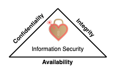
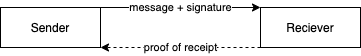

# Information security overview

## Information security

- Protecting information and information systems.
- Defines sets processes and activities performed in order to protect information.
- Goal is to prevent unauthorized users from stealing and misusing information or services.
  - If sensitive information falls in wrong hands, it may cause huge losses including
    - finances, brand reputations, customers.  

## Essential terms

### Hack value

- Hackers' evaluation of whether something is worth or interesting.
- High hack value examples
  - Accessing peoples credit card information as it can generate money.
  - Just accessing peoples names just to show a difficult task is doable.

### Vulnerability

- Weakness which can compromise the system and be used for a possible attack.
- E.g.
  - a policy
    - e.g. policy regulating whether a personal should stick in USB drives to computer laptops.
  - design/implementation errors
    - e.g. Linux + macOS + Windows are susceptible to a vulnerability where an USB drive that disguises as keyboard and have greater access on computer

### Exploit

- Breach through vulnerabilities.
- Also refers to a software that allows taking advantage of identified vulnerabilities.
- E.g. connecting a malicious USB.

### Payload

- Part of [malware](../07-malware/malware-overview.md) or exploit code.
- Used for e.g.
  - Creating [backdoor](./../07-malware/malware-overview.md#backdoor)s in victims machine
  - Damaging or deleting files
  - Committing data
  - Hijacking a computer
- E.g. a keylogger or a RAT (Remote Administration Tool) that a malicious USB installs.

### Zero day attack

- Also known as • ***zero-day attack*** • ***0-day attack*** • ***0 day attack***
- Exploiting previously unknown vulnerabilities before patch is released.
- **Zero day vulnerability**
  - Hole in software that is either [1]
    - Unknown to the one that's interested in mitigating in (e.g. vendor)
    - Known but patch has not been developed
  - Targeted attacks often include zero-day vulnerabilities [3]
  - ❗ A vulnerability is not zero day once it's disclosed and patched
- **Zero-day exploit**
  - Taking advantage of zero-day vulnerabilities
  - Often done by using malware [3]
- Flow
  1. Attacker discovers the vulnerability
  2. Attacker exploits vulnerability
  3. Attack happens (called day zero)
  4. Vendor learns about vulnerability
  5. Patch is created
     - Sometimes vendor may not patch it e.g. if software is outdated or has no support.
  6. Patch is applied
     - ❗ Sometimes they're not!
       - E.g. home routers has vulnerabilities that has been known for years as ISPs do not usually configure routers after setup
     - 💡 Time frame between patch is created and applied is used by malicious hackers to maximum extend.
       - Many times corporations are slower to react which causes harm.
- **Window of vulnerability (WOV)**
  - Time from vulnerability is discovered until most vulnerable systems are patched [1]
  - Often measured in days e.g. 28 days.
- E.g. [Spectre](./../06-system-hacking/escalating-privileges.md#spectre-vulnerability) & [Meltdown](./../06-system-hacking/escalating-privileges.md#meltdown-vulnerability)
  - Vulnerabilities in AMD and Intel CPUs
  - Can be exploited to elevate the privileges in the given system.
  - Still exists but no longer a zero day.
  - Affected all cloud providers, they needed to run firmware updates, updates provided by Intel that caused delays.

[1]: https://en.wikipedia.org/wiki/Zero-day_(computing)
[2]: https://us.norton.com/internetsecurity-emerging-threats-how-do-zero-day-vulnerabilities-work.html
[3]: https://blog.trendmicro.com/trendlabs-security-intelligence/common-misconceptions-it-admins-have-on-targeted-attacks/

### Daisy chaining

- An attack in which hackers gain access to one network/device and then using it to access next networks/devices.
- **Steps**
  1. Hackers gain access to a device within your system/network
     - e.g. smartwatch, refrigerator, PC.
  2. They move further by gaining access to next device in your network and then next and so on.
     - Potentially hacker  owns the network in the end.
- 🤗 **Example for hacking banks or similar**
  1. Go after person that has the most access.
  2. Hack that persons home router as attack vector.
     - Because it has the least resistance compared to corporate network.
       - Corporate network: has corporate firewalls, IT stuff, policies etc.
       - Home router: Rarely updated, full of vulnerabilities.
       - They usually run down-sized linux operating system.
     - An **attack vector** is a method or pathway used by a hacker to access or penetrate the target system.
  3. Scan devices that are connected to the router.
     - Can see communication (can be encrypted) but always sees ports, URLs, addresses being used.
     - E.g. mans PC, wifes PC, smart TV/refrigerator, his cell phone, wifes cell phone etc.
  4. Attack with different attack vector options:
     - Change the DNS settings, you can set yourself as DNS.
     - Put his computer to DMZ to expose his PC for access from outside world.
     - Apply phishing, exploits to the operating system of the devices.
     - Get access to one of the systems
       - E.g. an Android phone. They have many vulnerabilities.
         - They don't get updates after a while.
         - If they exceed design limits e.g. when operating when it's hot outside, then the hardware flaws occurring causes exploitable software attacks such as [Bitsquatting](https://en.wikipedia.org/wiki/Bitsquatting)
  5. Get access to
     - Information such as bank accounts, credit card details
     - After infecting one device, jump other devices in bank network if e.g. the mobile phone is also used in bank network.

### Doxing

- Finding and publishing someone's personally identifiable information (PII) for malicious reasons.
- E.g. an individuals name, e-mail address or sensitive data of an organization.
- E.g. confidential government files get leaked to the public.
- Steps
  1. Gather private and valuable information about a person/organization
     - E.g. photographs, SSN, social accounts, address...
     - Build a profile of target by learning more information e.g. through social media.
  2. Misuse collected information for different reasons.
     - E.g. identity theft, stealing financial information to use, coercing their target's into doing something they don't want to

### Bot

- Contraction of "robot"
- A software that can be controlled to execute predefined tasks.
- Used by hackers to control the infected machines for malicious reasons.
- Use-case
  - E.g. using a bot to control the computer and perform attacks on other computers
  - E.g. creating a botnet by infecting more machines

## CIA triad

- Also known as ***three principles of information security***
- Recognized widely as hearth (main focus) of information security
  - 
- Should function as as goals and objectives for every security program
- 📝 Ensures
  - [Confidentiality](#confidentiality): so no one can see what's inside.
  - [Integrity](#integrity): no one tampers data-in transit
  - [Availability](#availability): data is accessible on demand

## Elements of information security

### Confidentiality

- Ensures that information is available only to people who are authorized to access it.
- Improper data handling or a hacking attempt leads to confidentiality breaches.
- 💡 Controls: • encryption • classification • access control • proper disposal (e.g. of DVDs, CDs, etc.)

### Integrity

- Ensures the accuracy of the information
- Prevents improper and unauthorized changes—the
- 💡 Controls: • hashing • access control

### Availability

- Ensuring resources are available whenever the authorized user needs them
- 💡 Controls: • redundancy • data back-ups • antivirus • DDoS prevention

### Authenticity

- Ensures the quality of being genuine or uncorrupted, either:
  - **users** are actually who they present themselves to be through authentication
  - or a **document or information presented** is not corrupted.
- 💡 Controls: • users (biometrics) • smart cards • data ([digital certificates](./../15-cryptography/encrypting-communication.md#digital-certificate))

### Non-repudiation

- 📝 Guarantee that
  - sender of a message cannot deny having sent the message
  - recipient cannot deny having received the message
- 
- 💡 Controls: digital signatures, logging

## Functionality, usability, security triangle

- 
- Components
  - **Functionality**: the features of the system
  - **Usability**: GUI of the system and how user friendly it is.
  - **Security**: How the processes of the system are used and who is using them
- Interconnected
  - Any change made to one component directly affects decreases the other two.
  - E.g. if the system security is increased, then the functionality and usability of the system are decreased
    - Because of greater overhead of security with more checks or through greater examination.
  - 💡 Balance each and every one of them to get the desired levels of security, functionality, and usability.

## Document types

- **Standard**
  - Mandatory rules used to achieve consistency
- **Baseline**
  - Provide the minimum security level necessary.
- **Guideline**
  - Flexible, recommended actions users are to take in the event there is no standard to follow.
- **Procedure**
  - Detailed step-by-step instructions for accomplishing a task or goal
