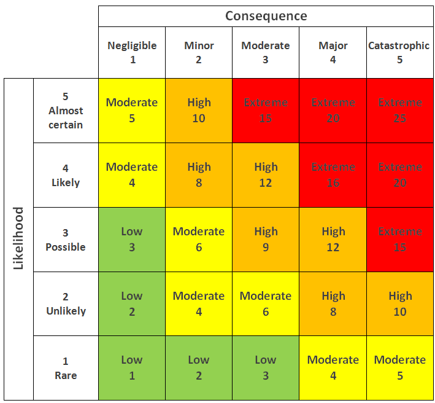

# Risk management

- Ongoing process of identifying, assessing and acting on potential risks.
- ❗📝 Risk management controls reduce risks but one can never fully eliminate all risk
  - Nothing is 100% risk-free.

## Risk

- **Risk**
  - Threat of damage or loss
- **Risk mitigation**
  - Also known as **risk reduction**
  - Taking action to reduce an organization's exposure to potential risks and reduce the likelihood that those risks will happen again.
- 📝 **Risk equation**
  - `Risk = Threat x Vulnerability x Asset`
  - E.g. network is very vulnerable (no firewall), asset is critical: high risk.
  - E.g. network is well protected, asset is critical: medium risk
- 📝 **Likelihood**
  - Likelihood is how probable it is that an event will occur
- 📝 **Impact**
  - Estimate of the harm that could be caused by an event

### Types of risks

- 📝 **Inherent risk**
  - Represents the amount of risk that exists before any controls are taken.
  - Raw and untreated risk
- 📝 **Residual risk**
  - Amount of risk that remains after controls are accounted for.
- **Control risks**
  - Risks that occur due to weaknesses in internal controls
- **Audit risk**
  - Risk of error while performing an audit.
  - Three types: Control risk, detection risk, inherent risk
- **Detection risk**
  - Verifier does not detect a material misstatement

### Level of risk

- Defined based on events possible consequences to evaluate.
- **Level of risk equation**
  - `Consequence x Likelihood`

  | Risk Level | Consequence | Action |
  | ---------- | ----------- | ------ |
  | **Extreme / high** | Serious danger | Measures should be immediately taken to reduce the risk |
  | **Medium** | Medium danger | Measures should be taken as soon as possible |
  | **Low** | Negligible danger | Preventive measures should be taken to mitigate the risk |

### Risk matrix

- Used to visualize risk probabilities and its consequences
- Most used method in risk analysis
- 

### Risk assessment

- 📝 Prioritizes risks based on severity and likelihood of occurrence
- 📝 Includes an analysis of threats based on the impact to the business
- E.g. [HIPAA security risk assessment tool](https://www.healthit.gov/topic/privacy-security-and-hipaa/security-risk-assessment-tool) to assess risks regarding: • administrative safeguards • technical safeguards • physical safeguards as defined in [HIPAA rules](./laws-standards-and-regulations.md#hipaa-rules).
- 💡 Risk assessor should be a trusted entity or contractor
  - As they'll receive detailed vulnerability information and security architecture information

## Risk management objectives

- Identify the potential risks
- Identify the impacts of those risks
- Create risk management strategy and plan
- Assign priorities to risks
- Analyze the risks
- Control the risk
  - e.g. education, enforcing a policy, changing a software etc..
- Develop strategies and plans for long lasting risks

## Risk management phases

1. 📝 **Identification**
   - What? Why? Consequences?
   - Data gathering activities include • threat identification • vulnerability identification • risk control analysis
     - Read more [NIST SP 800-39 (NIST Cybersecurity Framework)](https://www.nist.gov/privacy-framework/nist-sp-800-39)
2. **Assessment**
   - Likelihood and impact
3. **Treatment**
   - Prioritize, order and document.
   - Manage risks through [risk response types](#risk-responses)
4. **Tracking and review**
   - Ensures right actions were taken.
   - Is action obsolete? Can it be improved? Can cost be decreased?

## Risk responses

- 📝 5 risk responses are: • Avoid • Mitigate • Transfer • Accept • Share
- **Avoid**
  - Change the strategy/plan to avoid the risk.
- **Mitigate**
  - Take action to reduce the risk.
  - 💡 You should mitigate the risk to a low enough level so that the residual risk can be accepted as you will never be able to remove all risks.
- **Transfer**
  - Transfer risk to another party by e.g. outsourcing or purchasing an insurance.
- **Accept**
  - Decide to take the risk, as without risk there's no movement/rewards.
- **Share**
  - Distributing the risk, e.g. having two security architects so service can continue if one quits.

## Business continuity and disaster recovery (BCDR)

1. **Risk assessment**
   - Preparing risk analysis and business impact analysis
   - See also [risk assessment](#risk-assessment)
   - E.g. **Disaster recovery risk assessment**
     - Describes potential risks and their impact to the functioning of an organization.
     - Describes both natural and man-made disasters and estimates the probability of each scenario occurring
   - **Business impact analysis (BIA)**
     - Predicts the consequences of disruption of a business function
     - Process and gathers information needed to develop recovery strategies
     - Often includes [Annualized Loss Expectancy (ALE)](#annualized-loss-expectancy-ale) metrics.
     - Should be used identifying the potential consequences of a change, or estimating what needs to be modified to accomplish a change
     - 📝 **Business change impact analysis**
       - Allows you to identify consequences of a change
       - E.g. a new feature can cause resource load and crash the server.
2. **Business continuity plan (BCP)**
   - Covers critical processes recovery
   - 📝 Includes **Disaster recovery plan (DRP)** describing:
     - How an organization can quickly resume work after an unplanned incident
     - What to do to recover

## Annualized Loss Expectancy (ALE)

- Annual cost of a loss due to a risk.
- Used often in risk analysis and business impact analysis
- 📝 `ALE = ARO (Annual rate of occurrence) x SLE (Single loss expectancy)`
- **Annual rate of occurrence (ARO)**
  - E.g. if it occurs every month than it's 12, if it's every second year than it's 1/2
- **Single loss expectancy (SLE)**
  - Total loss value for a single asset after an exploit
  - `SLE (Single Loss Expectancy) = AV (Asset Value) x EF (Exposure Factor)`
  - **Asset value (AV)**
    - How much would it take to replace 1 asset
    - Including product prices, manhours etc.
  - **Exposure Factor (EF)**
    - Percentage of asset value lost if threat is realized
    - Usually a subjective value
- E.g. an asset is valued at $100,000, and the Exposure Factor (EF) for this asset is 25%. The single loss expectancy (SLE) then, is 25% * $100,000, or $25,000.
- **Total cost of ownership (TCO)**
  - Total cost of a mitigating safeguard
- **Return on Investment (ROI)**
  - Amount of money saved by implementing a safeguard.
  - 💡 Good choice if annual Total Cost of Ownership (TCO) is less than Annualized Loss Expectancy (ALE); poor choice otherwise

## Threat modeling

- Assessment to see how secure an application is
  - identify the threats
    - can e.g. use [OWASP top 10](https://owasp.org/www-project-top-ten/) as guideline.
  - discover application vulnerabilities
  - improve security
    - e.g. configure in better way, improve source code, enable encryption or ditch the application.
- 💡 Do it as soon as and often as possible
  - E.g. by design phase of the software security development lifecycle (SDL) process

### Threat modeling steps

1. **Identify security objectives**
   - Understand your integrity, confidentiality, and availability goals
2. **Application overview**
   - Understand application and its components (libraries and services), data flows and trust boundaries.
3. **Decompose application**
   - Document what each component does, entry and exit points, data flows and trust boundaries.
4. **Identify threats**
   - Done for each individual components
   - E.g. a misconfiguration (e.g. bad password policy, outdated encryption)
5. **Identify vulnerabilities**
   - End with vulnerabilities, overall assessment, prioritization of risks.

## Security Development Lifecycle (SDL)

- Set of guidance, best practices, tools, and processes by Microsoft
- Consists of different phases with different actions on each phase:
  1. **Training**
     - Core security training for developers
  2. **Requirements**
     - Setting level of security desired
  3. **Design**
     - [Threat modeling](#threat-modeling)
     - Attack surface analysis
     - Requirements
  4. **Implementation**
     - Static analysis
     - Turning off unsafe functions
  5. **Verification**
     - Dynamic analysis
     - [Fuzz testing](./../14-sql-injection/sql-injection-overview.md#fuzz-testing)
     - Attack surface reviews
  6. **Release**
     - Incident response plan
     - Final security review
     - Certification
  7. **Response**
     - Allow reporting security problems in products
