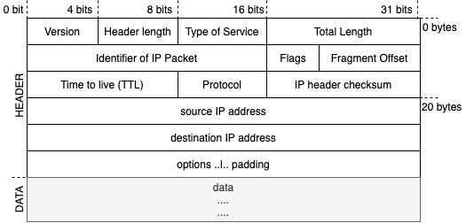

# Bypassing IDS and firewall

- Read more on [Intrusion Detection System Detection | Nmap](https://Nmap.org/book/subvert-ids.html#avoid-ids)
- See also • [Evading IDS](../11-firewalls-ids-and-honeypots/evading-ids.md) and [Evading Firewalls](../11-firewalls-ids-and-honeypots/evading-firewalls.md)

## Packet fragmentation

- Also known as ***IP fragment scanning*** or ***IP fragmentation***
- 📝 Splitting up TCP header to several smaller (fragmented) packets when sending
- Server then reassembles them once all packets are received.
- Usually ignored by IDSes as processing them requires a lot of computer resources
- Any IP datagram can be fragmented: including UDP, TCP, ICMP, etc.
- See also [session splicing](./../11-firewalls-ids-and-honeypots/evading-ids.md#session-splicing) for HTTP header variant.
- Tools
  - [Nmap](https://Nmap.org/book/man-bypass-firewalls-ids.html):  `-f` flag e.g. `nmap -f <ip-or-host>`
    - splits the packets into 8 bytes or less after the IP header
    - Alternatively can use `--mtu` option allows to set bytes e.g. `--mtu 16`
  - [`fragroute`](https://tools.kali.org/information-gathering/fragroute)
    - Usage: `fragroute <domain-name>`
    - Intercept, modify, and rewrite egress traffic to use fragments

## Source routing

- Also called ***path addressing***
- Specifying which path the malformed packet will take to get to the target host.
- Used to skip routes (routers/gateways) where firewalls exist
  - Disregards what route tables say
- ❗ Almost always blocked
- Done by modifying IP address field in IP Options field
  - 
- Using Nmap:
  - **Loose routing**
    - Specifying packet to be loose source routed through given IP way points
    - E.g. `--ip-options "L 192.168.0.7 192.168.30.9"`
  - **Strict routing**
    - You will have to specify every single hop along the path.
    - E.g.  `--ip-options "S 192.168.0.7 192.168.0.9 .. 192.168.30.9"`
- See also [IP address spoofing through source routing | Session hijacking](../13-web-applications/session-hijacking.md#ip-address-spoofing-using-source-routing).

## IP address decoy

- Also known as ***decoy scan***
- All packets originate from the scanning machine, but some have spoofed source addresses.
- **Pros**: Helps to confuse port scan detection
- **Cons**
  - Does not offer any information beyond a regular scan.
  - Slows down the scanning process
- Using Nmap:
  - `nmap -D decoy1,decoy2,ME,decoy3... <target>`: Manual list with custom positioned `ME`
  - or `nmap -D RND:10 <target>` to randomize 10 decoy IP addresses

## IP address spoofing

- Used to make packet appear to come from someone else
- Done by changing address information in IP packet header field
- Replies go back to the spoofed address not to the attacker
- Mostly used for DoS attacks
- Tools:
  - hping: `hping3 <target> -a <spoofed-ip>`
  - Nmap: `nmap <target> -S <spoofed-ip>`

### IP address spoofing detection techniques

- **Direct TTL probes**
  - Ping to suspect IP
  - If `TTL` in reply is not same as suspect packet, it may be spoofed
- **IP Identification Number**
  - Ping to suspect IP
  - `IPID` should be close to but higher than suspect packet
  - OS increases IP incrementally for each packet sent
- **TCP Flow Control Method**
  - **Sliding window protocol**
    - In TCP, for each packet `ACK` is expected back before sending another packet.
    - *Window* packets are allowed to be sent without having to wait for an ACK.
    - Allows packets to arrive out of order
    - Window size field in TCP header
      - Tells maximum amount of data sender can transmit without waiting for `ACK`
      - **Windows update packet** is used to negotiate a different window size.
  - Attacker that uses spoof IPs do not receive window size information
  - If victims receives data packets beyond the window size, they are spoofed packets

### IP address spoofing countermeasures

- Use encryption
  - Best prevention against IP spoofing attacks
- Avoid trust relationships
  - Also known as **no trust architecture**
  - Do not rely on IP-based authentication
  - Test all packets, even when they come from one of your trusted hosts
  - E.g. through password authentication, OAuth etc.
- Use firewalls and filtering mechanisms
- Use random initial sequence numbers (ISN)
  - As `SYN` is `ISN+1` it allows malicious connections.
  - E.g. if it's based on timed counter it's predictable
- Ingress filtering
  - Blocking incoming traffic based [access control lists (ACLs)](./../11-firewalls-ids-and-honeypots/firewall-overview.md#access-control-lists-acls)
  - Good against blocking unauthorized access
- Egress filtering against insider attacks
  - Blocking outcoming traffic
  - Good against insider attacks where e.g. malware can send information
- [SYN flooding countermeasures](./../13-web-applications/denial-of-service.md#syn-flood-countermeasures)

## Encryption

- 📝 Encryption over e.g. SSL/TLS or SSH is a good evasion as it "cripples" payload inspection.
- One way to be able to inspect is through **MITM attacks**
  1. The server-side encryption is terminated at the inspecting firewall
  2. The firewall re-encrypts the client-side connection and passes data in between.
- Other solution is to use **Network Traffic Analysis (NTA)**
  - It focuses more on unencrypted metadata rather than encrypted payload.
  - It uses behavioral analysis to sort through network traffic and identify dangerous or suspicious traffic based on what the traffic/host does on the network.

## Proxy servers

- Acts as an intermediary for requests from clients and servers
- `client <--> proxy <--> server`
- You can use [free public proxies](http://freeproxylists.net/) for educational purposes
  - ❗ Careful with public proxies as they can be malicious e.g. inject stuff into your traffic.
  - 💡 Have your own proxies set-up, see [steps for creating a proxy server](./../11-firewalls-ids-and-honeypots/honeypot.md#setting-up-a-proxy-server-as-honeypot)

### Usage by defenders

- As a firewall to protect internal network
- As a IP address multiplexer hiding IP addresses of internal servers.
- Anonymize web surfing to some extend e.g. with VPN services or [Tor](https://www.torproject.org/)
  - Mobile tools include [Shadowsocks](https://shadowsocks.org/en/index.html) (cross-platform sock5 proxy), [proxydroid](https://github.com/madeye/proxydroid) (http / sock4 / sock5 on Android)
- Filtering unwanted content such as ads
- Save bandwidth on local networks

### Usage by attackers

- To conceal the real source of the scan.
- To remotely access intranets/corporate resources using victim as proxy
- To do man-in-the-middle attacks by redirecting user traffic to the proxy
- To sniff user data
- Tools include
  - [Parox proxy](https://tools.kali.org/13-web-applications/paros) (outdated), or updated fork of it: [OWASP ZAP](https://www.zaproxy.org/)

#### Proxy chaining

- Helps to increase anonymity by using two or more proxies in chain:
  - like `your_host <--> proxy1 <--> proxy2 <--> target_host`

##### ProxyChains

- 📝 [Open source](https://github.com/rofl0r/proxychains-ng) unix tool to setup a proxy.
- Download a file using e.g. `proxychains4 wget <fileurl>`
- Configure through its configuration file `vim /etc/proxychains.conf`
  - E.g.

    ```txt
      sock4 127.0.0.1 9050
      http 159.65.133.175 3128
      http 50.198.134.65 80
    ```

### Anonymizer

- Proxy server that acts as an intermediary and privacy shield between a client computer and Internet provider
- Use-cases include
  - Bypassing internet censors
  - Ensuring privacy
  - Having protection against online attacks
  - Bypassing IDS and firewall rules (of e.g. companies or schools)

#### Types of anonymizers

- Networked anonymizers
  - Information is transferred through network of computers
  - **Pros**: Harder to analyze traffic
  - **Cons**: Nodes in the sequence can be compromised
- Single-point anonymizers
  - Information is transferred through single website
  - **Pros**: Protects IP and related information
  - **Cons**: Less resistance to sophisticated analysis

#### Anonymizer tools

- OS
  - [Tails](https://tails.boum.org/): Live OS to protect against surveillance and censorship
  - [Whonix](https://www.whonix.org/): Designed to run in VMs to increase security and privacy
- Software
  - [Invisible Internet Project (I2P)](https://geti2p.net)
  - [TunnelBear](https://www.tunnelbear.com)
- Mobile apps
  - [Orbot](https://guardianproject.info/apps/org.torproject.android/): Proxy with Tor
  - [Psiphon](https://psiphon3.com/en/index.html): Tunnel through VPN on Android

##### Tor

- Free and open-source software for enabling anonymous communication
- 📝 Stronger privacy than single [node proxies](#proxy-servers) or [proxy chains](#proxy-chaining) without encryption
- ❗ Anonymous as long as guard and exit nodes are not the same party and the traffic is over HTTPs
- VPN / Proxies (non-chained): Single point of failure
  - Provider knows who you are and what you browse
  - Provider may inject packets (e.g. ads) into traffic or record personal details.
- Tor traffic goes through at least 3 different servers (up to 5000) before destination
  - Provides separate encryption layer for each server
  - An observer cannot read or modify packets
  - Second server (middle relay) passes encrypted data without knowing more than its predecessor and descendant
  - Weaknesses
    - ❗ A bad first server (guard node) knows your IP but not what you sent or where.
    - ❗ A bad third server (exit node) sees your traffic but cannot know who sent the traffic.
      - ❗ Exit node can eavesdrop if the packet is not using HTTPS but HTTP
    - ❗ Will be no privacy if both the entry and exit nodes are hijacked by same hostile party.

##### I2P (Invisible Internet Project)

- Peer-to-peer alternative to [Tor](#tor)
- Each participant acts both as a client and as a router
