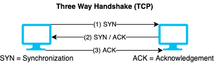

# TCP/IP

## TCP connection

### Three-way handshake

- Also known as • **3-way handshake** • **three-way handshake** • **3 way handshake** • **three way handshake**
- Establishes a TCP connection
- 📝 Sender: `SYN` → Receiver: `SYN ACK` → Sender: `ACK`
  - 
- `ACK` is then set in every packet sent after the handshake

### Termination

- 📝 Sender: `FIN` → Receiver: `ACK FIN` → Sender: `ACK`

## IPv4

- IPv4 loopback address (localhost of your own machine) is `127.0.0.1`

### IPv4 address types

1. **Unicast**
   - Acted on by a single recipient
2. **Multicast**
   - Acted on only by members of a specific group
3. **Broadcast**
   - Acted on by everyone in the network
   - Two types:
     - **Limited broadcast**
       - Delivered to every system inside a domain using:
         - IP: 255.255.255.255
         - MAC: FF:FF:FF:FF:FF:FF
       - Ignored by routers
     - **Directed broadcasts**
       - Sent to all devices on subnet
       - Use subnets broadcast address
         - E.g. if subnet is 192.168.17.0/24 then it uses 192.168.17.255
       - Routers may take action on the packets.

## IPv6

- IPv6 uses a 128-bit address instead of the 32-bit IPv4 version
- Represented as eight groups of four hexadecimal digits separated by colons
  - E.g. `2001:0db8:85a3:0000:0000:8a2e:0370:7334`
- Leading zeros can be removed e.g.
  - Original: `2001:0001:0002:0003:0004:0005:0006:0007`
  - Short: `2001:1:2:3:4:5:6:7`
- The loopback address is `::1`
  - Shortened version of `0000:0000:0000:0000:0000:0000:0000:0001`

## CIDR

- Method of the representing IP addresses
- 📝 Easy way to find out CIDR ranges, remember: `/24 255.255.255.0 256`
  - So `/24` gives 256 IP addresses, `/25` gives 128, `/26` gives 64 and so on.
- IPv4 Notation

  | CIDR Range | Total IP Addresses | Subnet mask |
  | ---------- | ------------------ | ----------- |
  | `/32` | 0 | `255.255` |
  | `/30` | 4 | `.225.252` |
  | `/28` | 16 | `.255.240` |
  | `/26` | 64 | `.255.192` |
  | `/24` | 256 | `.255.0` |
  | `/22` | 1024 | `.248.0` |
  | `/20` | 4096 | `.240.0` |

## TCP flags

- Used to indicate a particular connection state or provide additional information
- Size of each flag is 1 bit being either `0` or `1`
- 📝 Flag types
  - **Synchronization (`SYN`)**
    - Also known as **synchronization** flag.
    - Synchronize sequence numbers
    - First step of connection establishment (3-way handshake)
    - ❗ Only the first packet sent from each end should have this flag set
  - **Acknowledgement (`ACK`)**
    - Confirms successful packet retrieval
  - **Push (`PSH`)**
    - Tells receiver to process packets instead of buffering them
  - **Urgent (`URG`)**
    - Process packets directly before others, even if they're not complete
  - **Finish (`FIN`)**:
    - `1` indicate connection termination requests
    - Used in the last packet sent from the sender.
  - **Reset (`RST`)**
    - `1` aborts the connection in response
    - Sent from the receiver to the sender when a packet is sent to a particular host that was not expecting it.
    - Also used as
      - DDoS attack, see [`RST` attack](./../13-web-applications/denial-of-service.md#rst-attack)
      - Scanning technique, see [RFC 793 scans](./scanning-techniques.md#rfc-793-scans)

### Finish (`FIN`) vs Reset (`RST`)

| `FIN` | `RST` |
| ----- | ----- |
| Gracefully termination | Sudden termination |
| Only one side of conversation is stopped | Whole conversation is stopped |
| No data loss | Data is discarded |
| Receiver of `FIN` can choose to continue communicating | Receiver has to stop communication |

### Push (`PSH`) vs Urgent (`URG`)

| `PSH` | `URG` |
| ----- | ----- |
| All data in buffer are pushed | Only urgent data is pushed immediately |
| Data is delivered in sequence | Data is delivered out of sequence |

## TCP/IP sessions

- TCP uses stateful sessions
- Connection establishment must be done before data transfer
- **Session initiation**
  1. Source sends SYN packet
  2. Destination responds with SYN/ACK packet
  3. Source sends ACK packet
  - Connection stays open until closed with `FIN` or `RST` packets.
- Session termination

## OSI model

- Conceptual model that characterizes and standardizes the communication functions
- 📝 Uses seven abstraction layers:
  1. **Physical** (bits)
     - Media, signal & binary transmission
     - E.g. • Cables (fiber) • Fiber • Wireless • Hubs • Repeaters
  2. **Data link** (frames)
     - Physical addressing: MAC & LLC
     - E.g. • Ethernet • [PPP](./../15-cryptography/tunneling-protocols.md#ppp-point-to-point-protocol) • Switch • Bridge
  3. **Network** (packets)
     - Path determination & IP
     - E.g. • IP • [ICMP](./scanning-techniques.md#scanning-icmp) • [IPSec](./../15-cryptography/tunneling-protocols.md#ipsec) • IGMP
  4. **Transport** (segments)
     - End-to-end connections and reliability
     - E.g. • TCP • UDP
  5. **Session** (data)
     - Sync & send to ports, inter-host communication
     - E.g. • API's • Sockets • WinSock
  6. **Presentation** (data)
     - Syntax layer
     - Encrypts/decrypts if needed
     - E.g. • [SSL/TLS](./../15-cryptography/encrypting-communication.md#ssltls) (not entirely) • [SSH](./../15-cryptography/tunneling-protocols.md#ssh-secure-shell)  • IMAP • [FTP](./../15-cryptography/encrypting-communication.md#ftp-file-transfer-protocol) • MPEG • JPEG
  7. **Application** (data)
     - End User Layer: network process to application
     - E.g. • HTTP • [FTP](./../15-cryptography/encrypting-communication.md#ftp-file-transfer-protocol) • IRC • [SSH](./../15-cryptography/tunneling-protocols.md#ssh-secure-shell) • [DNS](./../04-enumeration/dns-enumeration.md#dns) • [SMTP](./../04-enumeration/enumeration-overview.md#smtp)
- See also • [Firewall types per OSI Layer | Firewall](./../11-firewalls-ids-and-honeypots/firewall-overview.md#firewall-types-per-osi-layer) • [Vulnerability stack | Hacking web applications](./../13-web-applications/hacking-web-applications.md#vulnerability-stack) • [Encryption types per OSI layer | Encryption algorithms](./../15-cryptography/encryption-algorithms.md#encryption-types-per-osi-layer)

## TCP/IP model

- TCP/IP model defines four levels:
  1. **Link layer**: • [ARP](./../08-sniffing/arp-poisoning.md#arp) • [PPP](./../15-cryptography/tunneling-protocols.md#ppp-point-to-point-protocol) • [MAC](./../08-sniffing/sniffing-attacks-overview.md#mac)
  2. **Internet layer**: • TCP • UDP • DCCP • SCTP ...
  3. **Transport layer**: • IP • ICMP • ECN • [IPSec](./../15-cryptography/tunneling-protocols.md#ipsec) ...
  4. **Application layer**: • [DNS](./../04-enumeration/dns-enumeration.md#dns) • HTTP • HTTPS • [FTP](./../15-cryptography/encrypting-communication.md#ftp-file-transfer-protocol) • [SSH](./../15-cryptography/tunneling-protocols.md#ssh-secure-shell)) • SMTP ...
- ❗ OSI model does not match well TCP/IP
  - [RFC 3439](https://tools.ietf.org/html/rfc3439) considers layering "harmful"
- ❗ E.g. SSL/TLS does not fit in any of OSI or TCP/IP layers
  - In OSI it's in layer 6 or 7, and, at the same time, in layer 4 or below.
  - In TCP/IP it's in between the transport and the application layers.

## TCP/IP vs OSI model

| TCP/IP | Protocols and services | OSI model |
| ------ |:----------------------:| --------- |
| Application | • HTTP • [FTP](./../15-cryptography/encrypting-communication.md#ftp-file-transfer-protocol) • Telnet • [NTP](./../04-enumeration/enumeration-overview.md#ntp) • DHCP • PING | • Application • Presentation • Session |
| Transport | • TCP • UDP | Transport |
| Network | • IP • [ARP](./../08-sniffing/arp-poisoning.md#arp) • [ICMP](./scanning-techniques.md#scanning-icmp) • IGMP | Network |
| Network interface | • Ethernet • PPTP | • Data Link • Physical |
