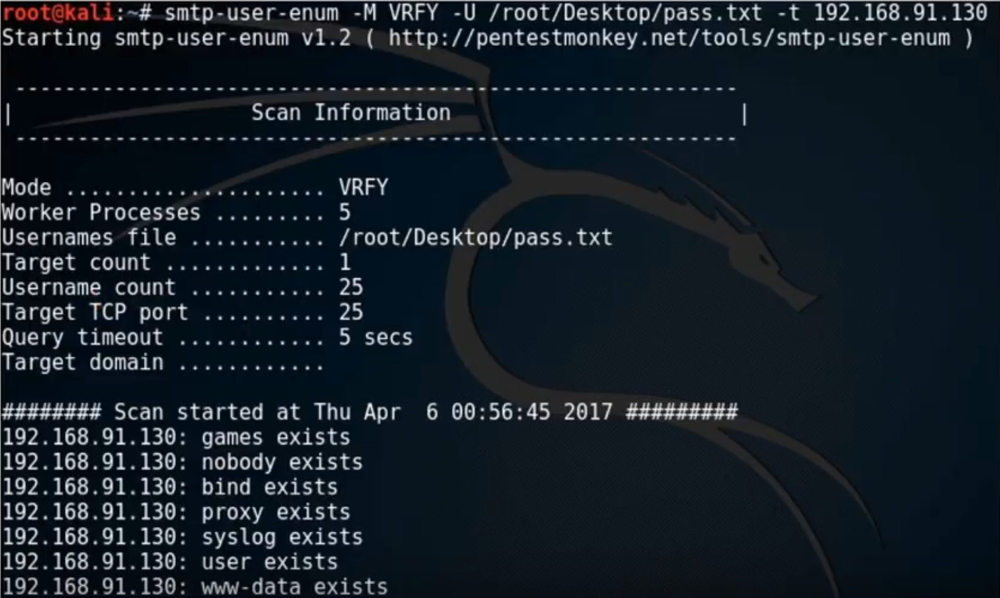

# Enumeration overview

- Actively engage a system and query it for information.
- Used to discover vulnerabilities and then exploit them.
- Information collected include routing tables, users and groups, machine names, network resources.

## Common ports and services to enumerate

- 📝 List of most commonly enumerated services and their ports

  | Port | Protocol | Service |
  | ---- | ---- | ------- |
  | 25 | TCP | [SMTP (Simple Mail Transfer Protocol)](#smtp-enumeration) |
  | 53 | TCP/UDP | [DNS (Domain Name System)](./dns-enumeration.md) |
  | 135 | TCP/UDP | Microsoft RPC Endpoint Mapper |
  | 137 | UDP | [NetBIOS Name Service](#netbios-enumeration) |
  | 139 | TCP | [SMB over NetBIOS](#netbios-enumeration) |
  | 161 | UDP | [SNMP (Simple Network Management Protocol)](#snmp-enumeration) |
  | 162 | TCP/UDP | [SNMP Trap](#snmp-enumeration) |
  | 389 | TCP/UDP | [LDAP](#ldap-enumeration) |
  | 445 | TCP/UDP | SMB over TCP |
  | 465 | TCP | [SMTP over TLS](#smtp-enumeration) |
  | 500 | UDP | ISAKMP/[IKE](./../15-cryptography/tunneling-protocols.md#ike-internet-key-exchange) |
  | 514 | UDP | Syslog, used for system logging |
  | 587 | TCP | [SMTP over **optionally*** STARTTLS](#smtp-enumeration) |
  | 1433 | TCP/UDP | Microsoft SQL Server |
  | 3268 | TCP/UDP | Global Catalog Service |
  | 5060, 5061 | TCP/UDP | SIP (Session Initiation Protocol) |

- Read more on [IANA ports list](https://www.iana.org/assignments/service-names-port-numbers/service-names-port-numbers.txt)
- See also • [Port monitoring | Malware analysis](./../07-malware/malware-analysis.md#port-monitoring) • [Common ports to scan | Scanning networks](./../03-scanning-networks/scanning-networks-overview.md#common-ports-to-scan)

## Enumeration techniques

- Extracting user names using email ID's
  - E.g. if the e-mail is tom.john@smith.com then tom.john is probably the user name
- Extract information using the default password
  - Identifying OS would tell the default password
  - If no one has changed it can be used to gather more information.
- [DNS enumeration](./dns-enumeration.md)

### Windows enumeration

- **Enumerating all shares**
  - `net share` or `net view \\serverName /all`
- **Enumerating machine configuration through null sessions**
  - Null sessions allow for enumeration of Windows machines to access information about the machine configuration.
  - E.g. `net use \\target\ipc$ "" /user: "`
- **Configurable services and server/workstation settings**
  - `net config`

### Windows user account enumeration

#### Security Identifier (SID)

- A **subject** can access an **object** with given **permissions**
- **Subject** (who)
  - Windows internally identifies entities as "Security Principals" also known as "Subject"s
  - E.g. user accounts, groups, computers and services
- Subjects are assigned SID (Security Identifier) by the system
- E.g. S-**1**-**5**-**21**-1852694824-1489621752-332472329-**500**
- 📝 Format: `S-<revision-level>-<authority-id>-<first-subauthority>-<o-N subauthorities>-<relative identifier(RID)>`
  - **Authority ID**
    - 0 - `SECURITY_NULL_SID_AUTHORITY` - null group or nobody
    - 1 - `SECURITY_WORLD_SID_AUTHORITY` - account Everybody
    - 2 - `SECURITY_LOCAL_SID_AUTHORITY` - group account Local (logged in users)
    - 3 - `SECURITY_CREATOR_SID_AUTHORITY` - Creator Owner
    - 5 - `SECURITY_NT_AUTHORITY` - Created by OS
    - There are [many more](https://docs.microsoft.com/en-us/troubleshoot/windows-server/identity/security-identifiers-in-windows)
  - **Sub Authority ID**
    - 5 - For applications that run under a specific session
    - 6 - When a process authenticates as a service
    - 21 - For SIDs that are not universal but has local significance
    - 32 - Identifies built-in SIDs
    - 80 - Identifies services' SIDs
  - **Relative identifier (RID)**
    - 500 - Administrator
    - 501 - Guest

#### Windows user account enumeration tools

- `user2sid` and `sid2touser`: Brings SID value for a given account name and vice versa
  - E.g. `user2sid \\SVR1 Guest`
  - Getting SID allows enumeration of accounts/groups by changing RID
    - E.g. `sid2user \\SVR1 5 21 1928525985 232339646 3462474693 501`
      - Returns like `Name is Guest`, `Domain is DEMO`, `Type of SID is SidTypeUser`
      - Syntax: `sid2user [\computer_name] authority subauthority_1 …`
- [`dumpusers`](https://vidstromlabs.com/freetools/dumpusers/): All-in-one tool to dump account names and information
- [`GetAcct`](https://packetstormsecurity.com/files/download/25056/getacct003.zip): Can dump account information as CSV file.
- From [SystemTools](https://www.systemtools.com/index.html):
  - [DumpSec](https://www.systemtools.com/somarsoft/index.html): lists all users and the groups they are in
  - [Hyena](https://www.systemtools.com/hyena/download.htm?gclid=EAIaIQobChMIq9udy-mF7QIVlB4YCh1yUgPoEAAYASAAEgK8T_D_BwE) dumps shares and user login names for Windows domain controllers and servers on same network.
- [PsGetSid](https://docs.microsoft.com/en-us/sysinternals/downloads/psgetsid): Translates SIDs to their display name and vice versa

### NetBIOS enumeration

- NetBIOS (Network Basic Input/Output System) is a unique name of a Windows machine.
- 📝 Allow computers
  - to communicate with others at the same time
  - to share files and printers
- Uses SMB (service message block) protocol
  - Network file sharing protocol.
  - 🤗 Was targeted by [WannaCry ransomware](https://en.wikipedia.org/wiki/WannaCry_ransomware_attack) who traversed the network and injected hosts.
- Easily exploitable, often used as one of the first scans.
- Helps to collect: • System name • Username • Domain • Printers • Available shares

#### NetBIOS enumeration tools

- [nbtstat](https://docs.microsoft.com/en-us/windows-server/administration/windows-commands/nbtstat)
  - Proprietary Windows diagnostic tool for NetBIOS over TCP/IP.
  - `nbtstat -a <IP or hostname>`: shows NetBIOS names
- `net view <IP or hostname>` prints available shares such as printers.
- [smb-nat](http://manpages.ubuntu.com/manpages/trusty/man1/smb-nat.1.html)
  - NetBIOS Auditing Tool)
  - `nat -o <output file> -u <user-list> -p <password-list> <ip/range>` allows you to brute force different usernames and passwords for administrative shares.
- [WinFingerPrint](https://github.com/kkuehl/winfingerprint)
  - Windows enumeration tool
  - Scan machines in LAN and returns shares, disk information, services, users (SID), groups..

### SNMP enumeration

- Also known as ***SNMP walking***
- SNMP stands for Simple Network Management Protocol.
- Used for
  - monitoring networking equipment
  - remotely modifying settings and configs on the equipment
- Was developed for routers and switches (1988)
  - Extended for linux/windows machines, printers, sensors, power supplies and more...
- Two kind of **community strings**:
  - Read community string: read-only.
    - You can collect information such as
      - System name, system uptime, network settings, CPU usage level etc.
  - Read/write community string: read-write (private) to edit configurations
  - 💡 SNMPv3 encrypts the community strings
- Consists of a **manager** and an **agent**
  - **Agent**s are embedded into network devices.
    - Agents send their information to manager using port 162.
    - Data messages are called traps.
  - **Manager** is installed on a computer.
    - Needs two passwords to access and configure the agents:
      - read community string
      - read/write community string
- **Object identifier (OID)**
  - Any device that can be monitored has an OID.
  - E.g. `1.3.6.1.2.1.2.2.1.8`
- **Management Information Base (MIB)**
  - Text-file that translates numerical OIDs to word-based OIDs.
    - E.g. `SYNOLOGY-SYSTEM-MIB::temperature.0`
  - You can collect information CPU usage level, disk usage level, network settings using vendor-specific OIDs.
- Version 1, 2: (❗️ insecure) No encryption, only "community string" and no encryption
- Version 3: Username + password and encryption

#### SNMP enumeration tools

- [**`snmpwalk`**](https://ezfive.com/snmpsoft-tools/snmp-walk/)
  - Enumerates ports in SNMP agent and finds out UDP port sending traffic to manager.
  - `snmpwalk -c public -v1 <agent IP address>`
  - Starts listening to the port.
- **`snmp-check`**
  - You can find out the version using `snmp-check <IP address> -v <version 1 or 2c>`
    - Gives much more information like routing tables, storage information, users etc.
- [**`snmp-get`**](https://ezfive.com/snmpsoft-tools/snmp-get/)
  - Retrieve specific OID information from target using `-o`
  - SNMP community string for SNMP v1/v2c.
    - E.g. `sysName.0` for system name
  - E.g. `snmpget -v 1 -c public system.sysName.0`

### LDAP enumeration

- See also [brute-forcing active directory](#brute-forcing-active-directory)

#### LDAP

- LDAP stands for Lightweight Directory Access Protocol
- Used by on-premises Active Directory (Microsoft)
- 📝 Hierarchical e.g. domain > child-domains > organizational units > users / groups / computers.
- May return information about usernames, addresses, servers, and other sensitive information.
  - could be utilized in a brute force or social engineering attacks.

#### LDAP enumeration countermeasures

- Use over encrypted and secure protocols e.g. by e.g.
  - **LDAP over SSL/TLS**
    - Also known as **LDAPS**
    - SSL/TLS is negotiated before LDAP protocol begins.
  - **LDAP over StartTLS**
    - STARTTLS is a way to take an existing insecure connection and upgrade it to a secure connection using TLS.
    - Communication is only encrypted after the connection is established.
- Use NTLM or Basic authentication
- Select a username different from your email address

#### LDAP enumeration tools

- [Jxplorer](https://www.jxplorer.org/)
- [LDAP Admin Tool](https://www.ldapsoft.com)
- [LDP.exe](https://docs.microsoft.com/en-us/previous-versions/windows/it-pro/windows-server-2012-r2-and-2012/cc771022(v=ws.11))
- [Softerra LDAP Administrator](https://www.ldapadministrator.com/)
- 📝 [`net use`](https://docs.microsoft.com/en-us/previous-versions/windows/it-pro/windows-server-2012-r2-and-2012/gg651155(v=ws.11)) to show list of connected resources and logged-in user accounts.

### NTP enumeration

#### NTP

- 📝 NTP (Network Time Protocol) is to synchronize computer clocks.
- E.g. machines in same domain in Active Directory must have same GMT clocks.
- Uses UDP 123
- Target accuracy
  - 10 ms over the public internet
  - 200 ms or better on a local area network
- 🤗 Usually companies have authority of time-source on their on-premises, it synchronizes to internet and everything else synchronizes to it.
  - Important for routers / switches to have logs with right timestamps.
- Attackers query NTP for
  - List of hosts connected to NTP server
  - Clients IP addresses, system names and operating systems.
  - Internal IP addresses can be acquired if the NTP server is on the DMZ

#### NTP enumeration tools

- [`ntptrace`](https://www.eecis.udel.edu/~mills/ntp/html/ntptrace.html): traces NTP servers back to the primary source.
- [`ntpdc`](http://doc.ntp.org/4.1.2/ntpdc.htm): monitors operation of the NTP daemon, ntpd
- [`ntpq`](http://doc.ntp.org/4.1.0/ntpq.htm): monitors NTP daemon ntpd operations and determines performance.
- Other tools include: • NTP Time Server Monitor • NTP server Scanner • Nmap • Wireshark • AtomSync • NTPQuery, • PresenTense NTP Auditor • PresenTense Time Server • PresenTense Time Client • Lan Time Analyser...

### SMTP enumeration

#### SMTP

- SMTP = Simple Mail Transfer Protocol (port: 25)
- Protocol used for sending/receiving e-mails.
  - Used by clients talk to SMTP servers
  - Used also by SMTP servers to talk to other servers.
- Secure/encrypted protocols include:
  - **SMTPS** is SMTP over TLS (port: 587)
    - 🤗 Like HTTPS is HTTP over TLS
  - SMTP can also run with STARTTLS (port: 467)
    - Compared to running over TLS, it encrypts communication AFTER the communication is established.
    - STARTTLS is also known as **opportunistic TLS** as it would fall back to unencrypted communication if server does not support it.
- See [MX records](./dns-enumeration.md#dns-records) to find SMTP servers
- Allows to validate e-mail addresses to ensure they exist
  - 🤗 One another: Go to provider → try creating account with that e-mail.
  - 🤗 Large collection of e-mails can be sold or used for phishing.
  - 🤗 Many e-mail senders (e.g. AWS Simple Email Service) blocks you if you send e-mails that will not reach the targets.
    - One idea is to create fake accounts in cloud providers → ask to increase soft limits → enumerate per accounts

#### SMTP enumeration through SMTP commands

- `VRFY`: validates e-mail address that actually exists
- `EXPN`: tells the actual delivery address of aliases and mailing lists
- `RCPT TO`: Defines recipients of the messages
- ❗ Some admins may turn off `VRFY` and `EXPN`, but not `RCPT TO` (or no one can receive e-mail)

#### SMTP enumeration through tools

- [NetScanTools Pro SMTP Server Tests Tool Description](https://www.netscantools.com/nstpro_smtp_server_tests.html)
  - Used to perform tests sending e-mails
- [`smtp-user-enum`](https://github.com/pentestmonkey/smtp-user-enum)
  - Enumerates OS-level user accounts on Solaris
  - Inspects responses to `VRFY`, `EXPN` and `RCPT TO`
  - 
    - `stmpy-user-enum -M <command> -U <list of emails> -t <SMTP server>`

### Brute forcing Active Directory

1. Get admin user with [SID 500](#security-identifier-sid)
   - `Get-ADUser -Filter * | where { $_.SID -like "*-500" }`
2. Brute-force its credentials
   - E.g. if user is `admin@cloudarchitecture.io`:
     - `net use \\%computername% "PasswordTest1" /u:admin@cloudarchitecture.io`
     - `net use \\%computername% "PasswordTest2" /u:admin@cloudarchitecture.io`
     - ...
