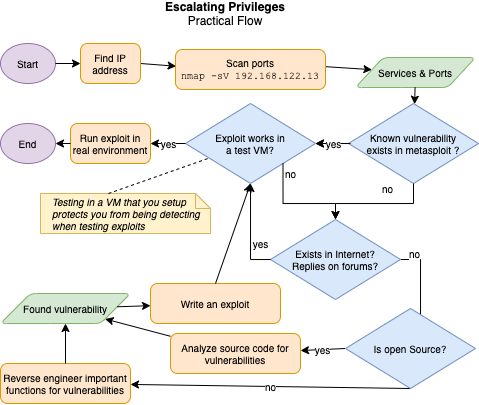

# Escalating privileges

- Exploiting OS and software vulnerabilities to gain admin privileges.
  - Generally by executing a malicious code that grant them higher privileges
- Becoming admin on the target system allows all sorts of malicious activities.

## Types of privilege escalation

- **Horizontal privilege escalation**
  - Acquiring the privileges of the same level
  - Allows executing files from a location that should be protected
- **Vertical privilege escalation**
  - Acquiring higher privileges

## Example flow of escalating privileges

- 

## Privilege escalation techniques

- **Path Interception**
  - Creating files at paths to be executed instead of legitimate targets.
  - Exploits misconfigurations, quotes, search orders
- **Web Shell**
  - Installed as backdoor to control from a remote server
- `setuid` and `setgid`
  - Setting them allows to execute files with more privileges than user in macOS and linux.

### Pivoting

- Using a compromised system as a launching point into other systems.
- E.g. in [Metasploit](./../05-vulnerabilities/automated-penetration-testing-tools.md#metasploit) you can add route to first compromised system to access the network beyond it.

### Windows techniques

#### Access token manipulation

- Access tokens are used in Windows as **security context** of a process or thread
- Every process user executes gets token issued for authentication user.
- User can modify the tokens so processes seem to belong another user.
- E.g. "run as" runs as administrator user therefor giving administrator privileges

#### File system permissions weakness

- Binaries in Windows execute with privileges of process that's executing it.
- Original binaries can be replaced with malicious ones to  privileges

#### Windows application shimming

- Shim = Windows Application Compatibility Framework
  - Compatibility layer for newer/older versions of Windows
  - Run in user mode and cannot modify the kernel
- Exploited to e.g. • Bypass UAC (RedirectEXE) • Inject malicious DLLs (InjectDLL) • Capture memory addresses (GetProcAddress)
- Allows attacker to e.g. • Disable Windows defender • Escalate privileges • Install backdoors

#### Windows applications DLL vulnerability

- **Reason**: Failure to supply a fully qualified path of a DLL library that is being loaded.
- **Behavior**: Application looks for the DLL in the directory from which it was executed.
- **Vulnerability**: Placing a malicious DLL into the directory and gain access to the system.

#### Scheduled tasks

- Used to escalate privileges, maintain persistence, start at startup etc.

### macOS techniques

#### OS X applications dynamic library vulnerability

- **Behavior**: OS X looks for dynamic libraries (`dylib`) in multiple directories when loading them.
- **Vulnerability**: Injecting malicious `dylib`s into one of the primary directories, which will then be loaded instead of the original one.

#### Launch Daemon

- Allows to execute malicious files at boot-up time.
- Enables escalating privileges, maintain persistence, start at startup etc.

### Meltdown vulnerability

- Affects some Intel chips
- Bypasses security mechanisms that prevent programs from reading arbitrary locations in system memory.
- If exploited, it gives attackers ability to read the memory outside of the program
- Allows attackers to
  - escalate their privileges
  - read information such as credentials, private keys, and so on.

### Spectre vulnerability

- Affects modern microprocessors
- Tricks a program into accessing the program's memory space.
- Allows attackers to
  - read kernel memory to obtain sensitive information
  - use JavaScript to launch a web-based attack

## Privilege escalation countermeasures

- Apply least-privilege: Never grant more privileges than needed!
- Use encryption and [MFA](./../01-introduction/identity-access-management-(iam).md#multi-factor-authentication-mfa)
- Run services as unprivileged accounts
- Patch and update regularly
- Ensure all executables are write-protected

### User Access Control (UAC)

- 📝 Prompts user for potentially dangerous software in Windows
- Limits softwares to user privileges until an administrator authorizes an elevation.
- 💡 Should be set to "Always Notify"

### Privilege escalation tools

- [BeRoot](https://github.com/AlessandroZ/BeRoot) to check common misconfigurations to find a way to escalate privileges on Linux and Windows
- [linpostexp](https://github.com/reider-roque/linpostexp): Linux post exploitation enumeration and exploit checking tools
- [Windows Exploit Suggester](https://github.com/AonCyberLabs/Windows-Exploit-Suggester) and [Linux Exploit Suggester](https://github.com/mzet-/linux-exploit-suggester)
