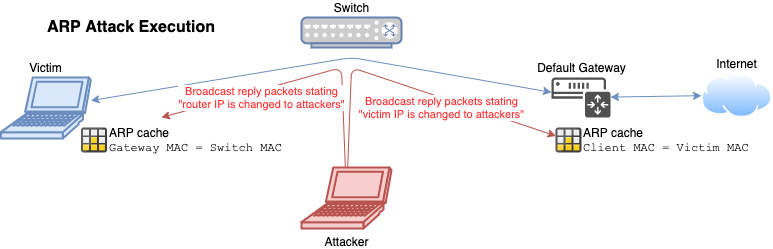
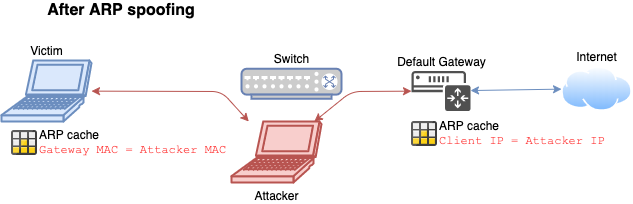

# ARP poisoning

## ARP

- ARP stands for "Address Resolution Protocol"
- 📝 In charge of resolving IP addresses to MAC addresses
- Can be used for obtaining MAC addresses of devices on the network
- Packets are `ARP_REQUEST` and `ARP_REPLY`
- Commands
  - `arp -a`: displays current ARP cache
  - `arp -d *`: clears ARP cache

### ARP table

- Used to map MAC addresses to ip addresses
- Every network interface has its own ARP table
- 📝 If no ARP entry exist:
  1. Computer A broadcasts an APR request in network asking for the MAC address from a specific IP.
  2. Computer B replies its MAC and IP address
  3. Computer A inserts it to its ARP table for future use

## ARP poisoning attack

- Also known as • ***ARP spoofing*** • ***ARP spoofing*** • ***ARP cache poisoning*** • ***ARP poison routing*** • ***ARP cache flooding*** • ***ARP flooding***.
- Man in the middle attack between the victim and switch.
- Floods the target machines ARP cache with forged requests and responses.
- Exploits ARP not verifying the device authenticity
- If ARP cache becomes full, different behaviors can be observed depending on the manufacturer/implementation:
  - May [force switch to operates in fail-safe mode](https://www.trendmicro.com/vinfo/se/threat-encyclopedia/archive/security-advisories/arp%20flooding%20attack)
    - Behaves as a hub i.e. sends packets to every to all hosts
    - Same behavior is also seen in [MAC flooding](./sniffing-attacks-overview.md#mac-flooding-attack)
  - In [Linux](https://git.kernel.org/pub/scm/linux/kernel/git/torvalds/linux.git/tree/net/core/neighbour.c#n388) it may:
    - Drop the oldest / most stale entry from the table (by garbage collector)
    - Reject new entries

### ARP poisoning attack steps

1. **Gather information**
   1. Get victim IP address, e.g. `192.168.122.183`
      - E.g. through [host discovery using `nmap`](./../03-scanning-networks/scanning-tools.md#-p-ping-host-discovery-options) e.g. `nmap -sn 192.168.0.0/24`
   2. Get default gateway IP, e.g. `192.168.122.1`
      - Usually IP of the machine ending with `.1`
      - Usually same for everyone on same network
      - Default gateway is the forwarding host (router) to internet when no other specification matches the destination IP address of a packet.
2. **Enable forwarding mode to sniff the traffic**
   - `echo 1 > /proc/sys/net/ipv4/ip_forward` in Linux.
   - ❗Otherwise no traffic is going through and you're just DOSing.
3. **Attack**
   - 
   - Deceive the victim device through flooding ARP reply packets to it.
     - Change gateways MAC address is to the attackers
   - 📝 Use an ARP spoofing tool e.g.
     - [`arpspoof`](https://linux.die.net/man/8/arpspoof)
       - `arpspoof -t <victim-machine-ip> <default-gateway-ip>`
       - `arpspoof -t <default-gateway-ip> <victim-machine-ip>`
     - [`ettercap`](https://www.ettercap-project.org/)
       - Also sniffs passwords automatically
       - `ettercap -NaC <default-gateway-ip> <victim-machine-ip>`
         - `N`: make it non-interactive
         - `a`: arp posion
         - `c`: parse out passwords and usernames.
     - [Cain and Abel (Cain & Abel)](./sniffing-tools.md#cain-and-abel) on Windows
   - 
4. **Sniff**
   - Now you sniff the traffic between two devices.
     - If through HTTPS & SSL you can only see basic data such as User Agent and domain names.
   - Can use e.g. [`wireshark`](https://www.wireshark.org/) or [dsniff](https://www.monkey.org/~dugsong/dsniff/)

### ARP poisoning attack countermeasures

- Configure [DHCP snooping](./sniffing-attacks-overview.md#dhcp-snooping)
- Add **static** IP-MAC entries to the cache.
  - Then it will not process any ARP Replies received unlike a dynamic ARP cache.
- Use Intrusion Detection Systems (IDS)

## ARP poisoning countermeasures

- **ARP spoofing detection and prevention**
  - Relies on some form of certification or cross-checking of ARP responses
  - Can be implemented on individual hosts, hypervisors or switches
  - 📝 E.g. [DHCP snooping](./sniffing-attacks-overview.md#dhcp-snooping) feature on switch OS can activate **Dynamic ARP Inspection** with an internal database.
  - ❗ Not possible if any host holds a static IP, and static ARP entries must be used.
- **Static ARP entries**
  - Manually mapping IP addresses to MAC addresses (maintaining ARP entries)
  - A lot of administrative overhead
  - Provides only basic security
- **OS security**
  - Linux ignores unsolicited replies, behavior can often be configured in other OSes
