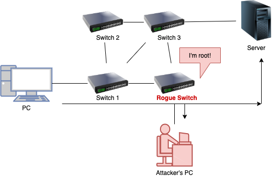

# Spoofing attacks

- Entails changing a computer's identity
- Allow the bypassing of access control lists on servers or routers
- Allows hiding a device on network by impersonating another network device / system.

## IP address spoofing

- Used most commonly in DDoS attacks.
- Helps with overcoming authentication based on IP addresses
  - Usually in corporate networks where trust between devices exists
  - E.g. accessing intranet without any password.
- ❗ The response is sent to the spoofed IP address instead of the spoofer.

### IP address spoofing countermeasures

- Packet filtering by a gateway
  - Ingress: block packets from outside of the network having an IP address within the network.
  - Egress: block outgoing packets from inside with a source address that is not inside
- 💡 Design network protocols and services so that they do not rely on the source IP address for authentication.
- Sequence number
  - Used by upper layer TCP
  - Negotiated to ensure that arriving packets are part of an established connection.
  - 📝 Must be guessed in order to hijack the connection

## MAC spoofing

- Response is received to spoofing party as opposed to IP address spoofing
- See also [MAC | MAC flooding | Sniffing attacks](./sniffing-attacks-overview.md#mac)

### MAC spoofing use-cases

- New hardware for existing Internet Service Providers (ISP) where ISP charges per device.
- Fulfilling software requirements where one software can only be installed on a single device.
- Identity masking for pushing responsibility for other users.
- **MAC address randomization**: Implemented in Android, Linux, iOS, and Windows to prevent third parties from using the MAC address to track devices

### MAC spoofing attack

- Flow
  1. Attacker sniffs the network for MAC addresses of legitimate users
  2. Spoofs one of those addresses
  3. The attacker receives the traffic intended for that user
- Effective against MAC filtering
- E.g. using `ifconfig`
  1. `ifconfig` to get name of network interface e.g. `eth0`
  2. `ifconfig eth0 down` to deactivate it to be able to change it (will lose connection)
  3. `ifconfig eth0 hw ether 88:88:88:88:88:88` to change the MAC address
  4. `ifconfig eth0 up` to change the MAC address
- E.g. using [macchanger](https://github.com/alobbs/macchanger)
  - `-r` to get a random MAC address e.g. `macchanger -r eth0`
  - `-m` set specify MAC address manually to pretend to be someone else

## STP spoofing

- STP: Spanning tree protocol
  - Layer 2 link management protocol
  - Provides path redundancy while preventing loops in the network
- Allows intercepting traffic when attacker emulates a device with a (lower) root switch identifier

### STP spoofing attack
  
- Also known as ***STP manipulation attack***, ***STP attack*** or ***STP root role attack***.
- Flow
  1. Attacker introduces a rogue switch
  2. Switch advertises superior BPDUs to force a STP recalculation
     - BPDU = Bridge Protocol Data Units (BPDUs)
       - Frames that contain information about STP that's between exchanged switches
  3. Rouge router becomes elected as root switch
     - All the traffic will cross this switch giving the attacker possibility to sniff all traffic in the company
  - 
- Allows for
  - **DoS attacks**
    - Recalculation of STP have interruption on the system as the root bridge changes
    - Just sending BPDU messages would be enough as becoming root is not needed.
  - **MITM attacks**
    - Also known as dual-homing (dual-homed)
    - Attacker uses two interfaces, one to win the root other to send data to the attacker.
    - 📝 Attacker can configure one of the switch ports as a [SPAN port](./sniffing-overview.md#port-mirroring) to receive copy of the traffic.
- Mitigations
  - Enable **Root Guard** to not forward traffic to port with superior BPDUs
  - Enable **BPDU Guard** to enforce the STP domain borders

## IRDP spoofing

- **IRDP**: ICMP Router Discovery Protocol
  - Protocol for computer hosts to discover routers on their IPv4 local area network.
  - ICMP router discovery messages are called "Router Advertisements" or "Router Solicitations"
- Vulnerable as it does not have any validation
- Attacker needs to be in the same network as the victim.
- Attacker adds bad route entries into a victim's routing table redirecting victim traffic to malicious address.
- Allows
  - Passive sniffing through rerouting victim machine to attacker machine
  - Man-in-the-middle where attacker acts as proxy
  - DoS by flooding wrong entries
- **Countermeasures**
  - Disable IRDP
  - Use digital signatures
  - Block all type 9 and type 10 ICMP packets.
