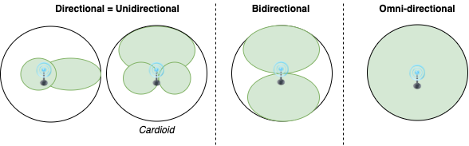
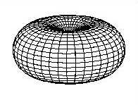
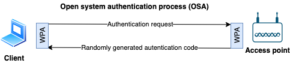
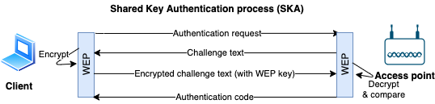

# Wireless networks overview

- Wireless network = Wi-Fi
- Type of Wireless Local Area Network (WLAN)
- Standardized by [IEEE 802.11](#wireless-standards)
- Allows devices in range of an access point to access the network.

## Wireless terms

- **Access Point**
  - Access Point (AP) or Wireless Access Point (WAP)
  - Hardware device that allows wireless connectivity to the end devices.
- **SSID (Service Set Identifier)**
  - Unique name for a wireless Access Point
  - Inserted into the header of every data packet.
- **BSSID (Basic Service Set Identifier)**
  - MAC address of an access point
- **GSM**
  - Global System for Mobile Communication
- **Bandwidth**
  - Amount of information that may be broadcasted over a connection
- **Hotspot**
  - Places where wireless network is available for public use
- **Orthogonal Frequency Division Multiplexing**
  - Encoding method of digital data on multiple carrier frequencies
- **Frequency-hopping spread spectrum (FHSS)**
  - Method of transmitting radio signals rapidly switching a carrier among many frequency channels
- **Phase Shift Keying (PSK)**
  - Modulation technique where phase of carrier signal changed by varying the sine and cosine inputs.
  - Widely used for WLANs, biometric and contactless operations, along with RFID and Bluetooth communications.

## Antenna patterns

- 
- 📝 Directional antenna patterns
  - **Directional antenna**
    - Also known as ***unidirectional antenna***
    - Broadcasts and obtains radio waves from a single direction (can be e.g. 30 - 60 degrees)
    - E.g. **Yagi** (also known as ***Yagi–Uda antenna***)
    - Most concentrated, higher range
    - **Parabolic grid antenna**
      - Based on the idea of a satellite dish
      - Can be attacked from farther away as it picks up Wi-Fi signal from 16 km and more
  - **Bi-directional antenna**
  - **Omni-directional antenna**
    - Broadcasts in 360 degrees
    - Most common type of antenna used in wireless communications and networks, especially WiFi
    - Used also in wireless base stations
    - Least concentrated and lower range
    - 
    - **Dipole**: Used for closer proximity e.g. mobile phones, client connections instead of site-to-site

## Wireless encryption

### Wireless encryption comparisons

#### WEP

- Wired Equivalent Privacy
- 1997, to provide data confidentiality
- Stream cipher RC4 for confidentiality
- CRC-32 checksum for integrity
- Authentication using WEP-Open and WEP-Shared (using a shared key) modes
- ❗ Weak as it reuses small IVs which allows decoding of its shared key.

#### WPA

- Wi-Fi Protected Access
- 2003, replace WEPs weak encryption
- Uses **Temporal Key Integrity Protocol (TKIP)**
  - Major improvement over WEP
  - Dynamically changes key as system is used
  - Combined with larger IV, this defeats well known attacks
  - Uses RC4 encryption
- Authentication using WPA-PSK and WPA-Enterprise modes
  - WPA-PSK uses pre-shared (symmetric) key to encrypt the wireless data
- Improved payload integrity vs. WEP
  - Uses more secure message integrity check (MIC) known as Michael
  - Includes a frame counter to prevent replay attacks
- Still subject to attack

#### WPA2

- Also known as ***Wi-Fi Protected Access 2*** or ***802.11i***
- 2004, replace WPAs weak cipher
- Authentication WPA2-Personal and WPA2-Enterprise modes
- Uses **Advanced Encryption Standard algorithm (AES)**
  - Much harder to decrypt than WPA or WEP
- 📝 Replaces TKIP with **CCMP** (AES-CCMP)
  - Also known as ***Counter Mode Cipher Block Chaining Message Authentication Code Protocol (Counter Mode CBC-MAC Protocol)*** or ***CCM mode Protocol (CCMP)***
  - Uses AES as encryption algorithm instead of RC4 in WPA.

#### WPA3

- Wi-Fi Protected Access 3
- 2018, introduce Dragonfly handshake, protects against dictionary attacks
- Authentication using WPA3-Personal and WPA3-Enterprise

#### Wireless cryptographic differences

| | WEP | WPA | WPA2 | WPA3 |
|-|-----|-----|------|------|
| Encryption | RC4 | RC4 + TKIP | AES-CCMP | AES-CCMP & AES-GCMP |
| IV Size (Bits) | 24 | 48 | 48 | 48 |
| Key Length (Bits) | 40/140 | 128 | 128 | 128/256 |
| Integrity Check | CRC-32 | Michael/CRC-32 | CBC-MAC, CCMP | BIP-GMAC-256 |

#### WPA2 and WPA3 Operation Modes

##### Personal

- Intended for home use, easier setup

##### Enterprise

- More complex setup, more granular control
- Uses [RADIUS authentication](./aaa-protocols.md#radius) with [Extensible Authentication Protocol (EAP)](./aaa-protocols.md#extensible-authentication-protocol-eap) extensions for more security

##### WPA2 vs WPA3 operation modes

| | Personal | Enterprise |
|-|----------|------------|
| WPA2 | Also called **WPA-PSK** (pre-shared key) as it uses PSK to protect network access | Same encryption |
| WPA3 | Also called **WPA3-SAE** (Simultaneous Authentication of Equals). Uses 128-bit key and [Forward Secrecy](./../15-cryptography/cryptography-overview.md#forward-secrecy) against dictionary attacks. | Uses 192-bit key |

## Wireless standards

- **802.15.1 - Bluetooth**
  - Read more on [bluetooth](./bluetooth.md)
- **802.15.4 - Zigbee**
  - Low-power, low-data-rate, and close-proximity wireless ad hoc networks.
  - Popular IoT connection protocol
- **802.16 - WiMAX**
  - Wireless on "steroids"
  - Written for global development of broadband wireless metropolitan area networks.
  - Big range and fast.
- **Comparing wireless standards**

- **802.11 Specifications**

  | Standard | Distance | Speed |
  | -------- | ----- | ----- |
  | WiFi | Medium (20-250 m) | Started slow (2 Mbit/s) but fast now (1300 Mbit/s)  |
  | ZigBee | Smallest (1-100 m) | Slow (up to 0.25 Mbit/s) |
  | WiMax | Biggest (1.6 - 9.6 km) | Fast (up to 1 Gbit/s) |

- 📝 Summary of the standards

  | Standard | Year | Summary |
  | -------- | ---- | ------- |
  | **802.11** (WLAN/**Wi-Fi**) | 1997 | • 2.4 GHz • DSS, FHSS • Up to 2 Mbit/s • 20 - 100 meters |
  | **802.11a** (Wi-Fi 2) | 1999 | • 5 - 3.7 GHz • OFDM • Up to 54 Mbit/s • 35 - 100 meters |
  | **802.11b** | 1999 | • 5.4 GHz • DSSS • Up to 11 Mbit/s • 35 - 140 meters |
  | **802.11c** | 2001 | Bridge operation procedures; included in the IEEE 802.1D standard |
  | **802.11d** | 2001 | International (country-to-country) roaming extensions |
  | **802.11e** | 2005 | Enhancements: QoS, including packet bursting |
  | **802.11f** | 2003 | Inter-Access Point Protocol, Withdrawn February 2006 |
  | **802.11g** (Wi-Fi 3) | 2003 | • 2.4 GHz • OFDM • Up to 54 Mbit/s • 38 - 140 meters |
  | **802.11i** | 2004 | Defines WPA/WPA2 encryption standards |
  | **802.11n** (Wi-Fi 4) | 2009 | • 2.4 - 5 GHz • MIMO-OFDM • Up to 600 Mbit/s • 70 - 250 meters |
  | **802.11ac** (Wi-Fi 5) | 2012 | • 5 GHz • MU-MIMO, • Up to 1300 Mbit/s • 70 - 250 meters |
  | **802.11ax** (Wi-Fi 6) | 2019 | • 1 - 6 GHz • MU-MIMO, OFDMA • Up to 11 Gbit/s • 70 - 250 meters |
  | **802.15.1** (WPAN/**Bluetooth**) | 2002 | • 2.4 GHz • GFSK, π/4-DPSK, 8DPSK • Up to 50 Mbit/s • 70 - 250 meters |
  | **802.15.4** (Low rate WPAN/**ZigBee**) | 2003 | • 0.868, 0.915, 2.4 GHz • O-QPSK, GFSK, BPSK • Up to 0.25 Mbit/s • 70 - 250 meters |
  | **802.16** (**WiMAX**) | 2005 | • 2-11 GHz • SOFDMA • Up to 1 Gbit/s • 1.6 - 9.6 kilometers |

- See also [all 802.11 standards and amendments](https://en.wikipedia.org/wiki/IEEE_802.11#Standards_and_amendments)

## Wi-Fi authentication

### Wireless authentication modes

#### Open system authentication process (OSA)

- Uses WPA protocol.
- Complete free for all, no auth at all
- 

#### Shared key authentication process (SKA)

- Uses WEP protocol + a shared secret key
- 

### IEEE 802.1x

- 📝 Authentication mechanism for both wireless and physical access to a network
- Authenticate devices to decide to give e.g. corporate or guest access
- Switches uses back-end authentication server, see [AAA](./aaa-protocols.md)
- Can authenticate based on MAC address or other requirements (certificate, VLAN etc.)
- Per default all hosts on a wired connection (LAN) can see each other
