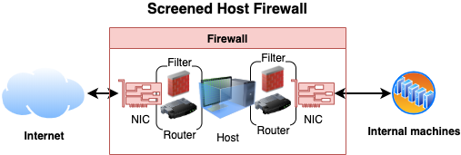
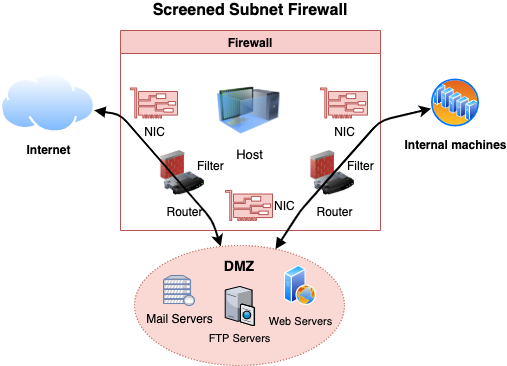
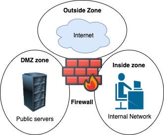

# Firewall overview

- Monitors network traffic and allows or blocks traffic based on a defined set of rules
- Predefined rules ensure only allowed incoming and outgoing traffic can pass through.
- Gateway/filter between two networks usually between private and public (internet)

## Firewall architecture

### Multi-homed firewalls

- Also known as ***multi-homed hosts***, ***multihomed hosts***, ***multi homed hosts***, ***multi homed firewalls*** or ***multihomed firewalls***.
- 📝 A host / firewall that has more than single network interface (NIC)
- Each interface are connected to separate network segments

### Dual-homed firewalls

- Dual-home can be a proxy, gateway, firewall etc.
- A special case of [bastion hosts](#bastion-hosts).
- Allows them to transfer data between the two networks
- Has two interfaces
  - External or public, usually to untrusted network such as Internet
  - Internal or private, usually to trusted network such as Intranet
- **Screened Host**
  - Firewall architecture where two filters are used
  - 

#### Bastion hosts

- Mediates traffic between inside and outside networks
- Designed and configured (hardened) to withstand attacks
- Usually hosts a single service e.g. a proxy server

### Screened subnet firewalls

- Screen subnet is also known as **DMZ** or **perimeter network**.
- Used to secure servers that are accessible from the internet.
- Consists of three zones:
  1. External (e.g. to internet)
  2. 📝 Demilitarized Zone (DMZ)
     - Placed in-between internal (trusted) and external (untrusted) network
     - Usually where bastions are placed
  3. Private (to internal network e.g. intranet)
- 
- Two routers
  1. External router separating traffic from a perimeter network (DMZ)
  2. Internal router separating perimeter from internal network
- Can be achieved through either
  - Single firewall with three interfaces
    - See also [zone-based firewall](#zone-based-firewall)
  - Three different firewalls
    - 💡 Better as compromising one won't compromise all

## Firewall categories

- **Hardware Firewall**
  - Device placed on the network's perimeter
  - Uses packet filtering technique to filter the traffic
  - Can be a standalone device or part of a router
- **Software Firewall**
  - Filters traffic on the installed machine
  - Protects its host from unauthorized access, trojans, viruses, and worms.

### Software vs Hardware firewalls

| Attribute | Hardware firewall | Software firewall |
| --------- | ----------------- | ----------------- |
| Price | More expensive | Cheaper |
| Maintainability | Hard | Easy |
| Speed | Faster response time | Slower response times |
| Interference | Minimal, can easily remove/replace etc. | Difficult to uninstall |

## Firewall types per OSI Layer

- 📝 Technologies used per OSI layer

  | OSI Layer | Firewall technologies |
  | --------- | --------------------- |
  | 7. Application | • Virtual Private Network (VPN) • Application Proxies • Web Application Firewall (WAF) •  Request filtering based on headers and payload |
  | 6. Presentation | • Virtual Private Network (VPN) |
  | 5. Session | • Virtual Private Network (VPN) • Circuit-level gateway |
  | 4. Transport | • Virtual Private Network (VPN) • Packet filtering based on port numbers |
  | 3. Network | • Virtual Private Network (VPN) • Network Address Translation (NAT) • Packet filtering, Stateful multilayer inspection |
  | 2. Data Link | • Virtual Private Network (VPN) • Packet filtering |

- 📝 All vulnerabilities in one layer is independent of the other layer.
  - E.g. cross-site scripting (application layer) vulnerable application would be vulnerable to it regardless of any protection on other layers.
  - Also vulnerabilities exist at network layers would not be visible to a stateful
- 💡 In most cases, you'd use both a L3 and an L7 firewall and the two complement each other.
- See also [OSI model](./../03-scanning-networks/tcpip-basics.md#osi-model)

### Packet filtering firewalls

- Implemented on the Network Layer, usually part of routers
- Designed to analyze each packet individually to apply a set of filters
- 📝 Examines the packets headers for source, destination, protocol, destination port, flags..
- Packet is dropped (not forwarded to its destination) if it does not comply with the predefined rules
- 📝 Can be [stateful](#stateful-firewalls) (mostly, newer) or stateless (older).
- Ineffective in preventing Web Application attacks as port 80 and 443 would not be blocked.

#### Access Control Lists (ACLs)

- Usually packet filtering rules are defined using ACLs (access control lists)
- Known also **Wireless Access Control List (WACL)** as in wireless routers.
- 📝 Type of rule-based access control
- 📝 E.g.
  - In Linux using [iptables](https://en.wikipedia.org/wiki/Iptables), disable all incoming SSH using `iptables -A INPUT -p tcp --dport 22 -j DROP`
  - In Windows it's controlled with `netsh advfirewall` (older: `netsh firewall`)
  - E.g. on [Cisco routers](https://www.cisco.com/c/en/us/support/docs/security/ios-firewall/23602-confaccesslists.html) using `access-list 101 deny tcp any host 100.100.100.1 eq 22`
    - where `101` is sequence number that helps with ordering of the rules
      - the lower the number is the higher priority it gets in the ordering
    - ACL are processed in top down meaning if a condition is met all processing is stopped.

#### Packet inspection

##### Port-based classification

- E.g. TCP 80 = HTTP
- Old way, today it's useless as assumptions can be wrong

##### QoS markers (DSCP)

- Similar to port-based but based on QoS tags for prioritization
- Ignored as it's easy to cheat and forge

##### Statistical traffic classification

- Based on manual rules or ML (machine learning) dataset
- Hard to create a good dataset and poor accuracy for cases outside of the set

##### Deep Packet Inspection (DPI)

- Inspecting packet payload
- Encrypted payload (e.g. HTTPS) ensures privacy and confidentiality
- Can see DNS query name, HTTP Host/Server fields and SSL/QUIC SNI (Server Name Indication)
- Important for cloud applications sharing same IPs
- Used in e.g. state censorship, and cloud-generation firewalls
- Tools: [ntop](https://github.com/ntop/ntopng) that's based on [nDPI](https://github.com/ntop/nDPI)

#### Stateful firewalls

- Also known as ***stateful inspection firewalls***
  - Stateful inspection is also known as **dynamic packet filtering**
- Keeps state of open connections.
- When a packet arrives, its header is examined to determine if it belongs to an already established connection.
- If it belongs to a connection, then it's allowed to go through
- Analyzed against defined set of rules to determine if connection is allowed to flow through
- E.g. will filter `ACK` without [TCP connection](./../03-scanning-networks/tcpip-basics.md#three-way-handshake) establishment (with `SYN`)

##### Zone-based firewall

- 
- Type of [stateful](#stateful-firewalls) network and [multi-homed](#multi-homed-firewalls) firewalls.
- Allows setting up rules such to filter / inspect traffic between zones.

###### Firewall zone

- Logical area in which the devices having same trust levels resides.
- An interface is assigned to a zone.
- By default, traffic is not allowed from one zone to another.
- Common zones
  - **Private**: inside | Most trusted network
  - **Public**: outside | Untrusted network
  - **DMZ (demilitarized)**: neutral | Sits in-between private and outside

#### firewalld

- Zone-based network level firewall on Linux
- Rules can be
  - **Runtime**: For duration of the session
  - **Permanent**: Persists through reboot or reload of a firewall
    - ❗ Requires `firewall-cmd --reload` to apply the rules.
- Commands:
  - Install: `yum install firewalld`
  - Start: `systemctl start firewalld`
  - Add rule (allow access): `firewall-cmd --permanent --zone=public --add-port=80/tcp`
  - Remove rule (deny access): `firewall-cmd --permanent --zone=public --remove-port=80/tcp`
  - Reload to apply changed rules: `firewall-cmd --reload`
  - Block access from different countries through geo IP block
    1. Download ip blocks at e.g. [ipdeny.com](https://www.ipdeny.com/ipblocks/)
       1. Download: `wget https://www.ipdeny.com/ipblocks/data/countries/all-zones.tar.gz`
       2. Extract: `tar -vxzf all-zones.tar.gz`
    2. Create a list called e.g. `blacklist`: `firewall-cmd --permanent --new-ipset=blacklist --type=hash:net --option-family=inet`
       - `--type`: `hash` is the storage type, `:net` is to block whole subnet
       - `--inet`: ipv4
    3. Add entries to list: `firewall-cmd --permanent --ipset=blacklist --add-entries-from-file=us.zone`
    4. Apply entries in list
       - Deny access: `firewall-cmd --permanent --zone=drop --add-source=ipset:blacklist`
       - `firewall-cmd --reload`
- In `/etc/firewall/firewall.d` file you can e.g. enable logging for denied traffic.
  - 💡 Careful for what you log as they can grow rapidly as servers, web applications etc. are also logging.

### Circuit level gateway firewalls

- Also known as **circuit-level gateway**
- 📝 Monitors TCP handshakes to determine if the requested connection is legitimate.
- 📝 Implemented on
  - OSI model: Session Layer (5)
  - TCP/IP stack: Between application (4) and transport layer (3)
- It acts as a proxy server using address translation
  - Maps all of internal IP addresses to one "safe" IP address for incoming packet
  - Address is associated with the firewall from which all outgoing packets originate
  - Provides security as untrusted network is only aware of single IP address

### Application level firewalls

- Also known as **proxy firewall**, **application firewall** or **gateway firewall**.
- Installed on a proxy server to act as a barrier between internal and external networks.
- Implemented on the application layer.
- 📝 Designed to filter traffic only for the protocols for which they are configured.
- Exposes single address instead of exposing internal network.
  - Clients first establish a connection with a proxy firewall, and then a new network connection is initiated on the client's behalf.
  - Utilizes NAT (Network address translation) to make the translations
- Can function in two modes:
  - **Active application-level firewalls**: Actively reject or deny requests
  - **Passive application-level firewalls**: More like IDS, does not filter

#### Web Application Firewall (WAF)

- Type of an application firewall that filters, monitors, and blocks HTTP traffic to and from a web service.
- 📝 It can prevent attacks exploiting a web application's known vulnerabilities
  - E.g. [injection](./../13-web-applications/owasp-top-10-threats.md#injection), [cross-site scripting (XSS)](./../13-web-applications/owasp-top-10-threats.md#cross-site-scripting-xss), file inclusion, and improper system configuration.

#### Application level vs Network level Firewalls

| Capability | Application level | Network level |
| ------- | ----------------- | ------------- |
| **Configuration** | Advanced | Narrow (IPS and ports) |
| **Coverage** | Small (protocol-specific) | Wider (any IP-based) |
| **Speed** | Slower | Faster |
| **Application threats** | Greater security | Blind |

- 💡 Use multiple layers of defense in depth
  - Level 3 firewall at the edge that only allows inbound traffic on the specific ports used by apps
  - Route those ports to an L7 firewall for deeper inspection.

### Stateful multilayer inspection firewall

- Combination of different firewalls:
  - [packet filtering](#packet-filtering-firewalls) *(network layer)*: to filter packets
  - [circuit level](#circuit-level-gateway-firewalls) *(session layer)*: to verify legitimate sessions
  - [application level](#application-level-firewalls) *(application layer)*: to evaluate packets
- A type of **hybrid firewall** as it's a mix of some of the firewalls already

### Network Address Translation (NAT)

- Implemented by many firewalls just like routers
- Enables LAN to use different sets of IP addresses for external and internal traffic.
- NAT modifies the packet's IP header and translates one address space into another
- NAT allows to hide the layout of the internal network.
- **Basic NAT**
  - One-to-one mapping where each internal IP is mapped to a unique public IP.
  - Too expensive to implement
- **Port address translation (PAT)**
  - Also known as ***network address and port translation (NAPT)***, ***IP masquerading***, ***NAT overload*** and ***many-to-one NAT***.
  - Allows multiple internal IP addresses to be mapped to single public IP
  - Uses different port (and other items) for each web conversation.
  - Typically used as is the cheaper option.
- Dynamic vs Static NAT
  - **Static NAT**: one-to-one internal to public static IP address mapping
  - **Dynamic NAT**: uses a group of available public IP addresses.

### Virtual Private Network (VPN)

- A network which enables a secure connection to a private network through the Internet.
- Information is protected by encryption and integrity checks.
- Can use e.g. [IPSec](./../15-cryptography/tunneling-protocols.md#ipsec) or [OpenVPN](./../15-cryptography/tunneling-protocols.md#openvpn) tunnelling protocol.
