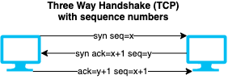

# Session hijacking

- Targeting a session between two machines to gain access
- Exploits vulnerabilities in session generation logic.
- Common ways are to ***guess*** or ***steal*** a valid session token.
- Types
  - **Passive session hijacking**: Monitoring the traffic without interference, e.g. through sniffers.
  - **Active session hijacking**: Becoming participant in the communication with target server.
- Spoofing vs Hijacking
  - **Spoofing**: attacker pretends to be another user
  - **Hijacking**: process of taking over an existing active session

## Steps of session hijacking

1. **Sniff** the network traffic between two machines
   - Using e.g. [Wireshark](https://www.wireshark.org/), [Capsa Network Analyzer](https://www.colasoft.com/capsa/), [Windump](https://www.winpcap.org/windump/), [Ettercap](https://www.ettercap-project.org/) etc.
2. **Monitor** the traffic to predict sequence numbers
   - E.g. using a proxy server trojan to change the proxy settings in the victim's browser.
3. **Session Desynchronization** to break the connection
   - Can use automated tools such as [OWASP Zed Attack Proxy](https://www.zaproxy.org/), [Burp suite](./../05-vulnerabilities/vulnerability-analysis.md#burp-suite) to hijack sessions.
4. **Session ID prediction** to take over the session
   - Cracking is easy if it is URL encoded, HTML encoded, unicode encoded, base64 encoded, or hex encoded.
   - Otherwise it can be brute-forced with possible range of values for the session ID
5. **Command Injection**
   - 📝 E.g. using `ettercap` [filters](https://github.com/Ettercap/ettercap/blob/master/share/etter.filter.examples) for e.g. [JS injection](https://github.com/Ettercap/ettercap/issues/796)

## Session hijacking attacks in OSI layers

### Application Layer session hijacking attacks

- To goal is to acquire a valid session ID
  - Allows to bypass the authentication schema of an application.
- **Session sniffing**
  - Using sniffers to capture traffic, then analyzing it to find a valid session token.
- **Session token prediction**
  - Requires understanding of token generation that can be through:
    - Analyzing some collected session IDs
    - Brute-forcing to generate and test different values of session ID
- **Session hijacking using proxy servers**
  - Attacker creates a proxy webpage that looks legitimate
  - Server forwards requests to legitimate server while capturing session information.
- **Session replay attack**
  - Eavesdropping traffic between target and its user to capture users authentication token
  - Once the token is captured the session is replayed with server to be authenticated
- **Session fixation attack**
  - 📝 Attacker creates a session with server and trick target into authenticating themselves with attackers session ID.
- **Man-in-the-middle attack**
  - Accessing to and possibly manipulating the communication channel between two machines.
- **Man-in-the-browser attack**
  - Using a trojan (e.g. a malicious extension) to infect the browser
  - Usual to target financial transactions
- **[Cross-Site Scripting (XSS) Attack](./../13-web-applications/owasp-top-10-threats.md#cross-site-scripting-xss)**
  - 📝 Injecting scripts on web pages to execute on target system to get session ID.

#### CRIME attack

- CRIME = Compression Ratio Info-leak Made Easy
- Exploit against web cookies in HTTPS, TLS and SPYDY protocols that uses compression.
- Server can refuse compression to prevent it.

##### BREACH attack

- BREACH = Browser Reconnaissance and Exfiltration via Adaptive Compression of Hypertext
- Instance of CRIME attack for HTTP using gzip or DEFLATE data compression.

#### Cross-Site Request Forgery (CSRF)

- Also known as ***XSRF***, ***Sea Surf*** or ***Cross Site Request Forgery***
- 📝 Using a trusted site to submit malicious requests to target server.
- E.g. transferring funds, changing password/email
- The data is accepted as user is authenticated with a valid session on the target server.
- Usually done by a link sent by attacker to a victim usually by phishing
  - E.g. `https://cloudarchitecture.io/account?new_password=abc123`
  - Another way is to send another website e.g. `cat.com`
    - `cat.com` sends an AJAX (JavaScript) request to `https://cloudarchitecture.io/account?new_password=abc123`

##### CSRF countermeasures

- **Anti-forgery token**
  - Cookies with randomly generated values that are validated on back-end
  - Ensures that only visiting the website sets the cookie and another website does not have access to the cookie.
- **SOP (same-origin policy)**
  - Ensures that the session cookie (or anti-forgery token) can only be accessed by the legitimate website.

##### CSRF vs XSS

- **Similarities**
  - Both are client-side attacks
  - Both require need some action of the end user
    - E.g. clicking on a link or visiting a website
- **Examples**
  - CSRF: Involuntarily change password using victim's already logged cookie/session
    - Through `https://cloudarchitecture.io/account?new_password=abc123`
  - XSS: Involuntarily execute client-side code
    - `https://cloudarchitecture.io/search?q=">`
- **Differences**
  - XSS executes a malicious script in victims browser
    - CSRF sends a malicious request on victims behalf
  - XSS is generally more serious vulnerability than CSRF
    - CSRF often only applies to a subset of actions that a user is able to perform
    - XSS exploit can normally induce a user to perform any action that the user is able to perform
  - CSRF is "one-way" while an attacker can induce the victim to issue an HTTP request without retrieving response
    - XSS is "two-way" where response can read response and exfiltrate data to an external domain of the attacker's choosing.
- Read more on [Cross-Site Scripting (XSS)](./../13-web-applications/owasp-top-10-threats.md#cross-site-scripting-xss) and [CSRF](#cross-site-request-forgery-csrf)

### Network Layer session hijacking attacks

- The goal is to intercept the packets transmitted between the client and the server.

#### TCP/IP Hijacking

- Uses spoofed packets to hijacks the connection and redirecting victims traffic to own computer.
- Requires knowledge of IP addresses communicating with each other
- Runs on layer 3 as IP address is a layer 3 (network level) address
- 📝 Requires guessing the SEQ (sequence number) that increases by 1
  - 
  - ❗ Very hard
- Alternatively man-in-the-middle attack is used.
  1. Discover two PCs communicating with each other
  2. DoS one
  3. Redirect the traffic to own computer.
- Tools
  - [`Shijack`](https://packetstormsecurity.com/sniffers/shijack.tgz) is most common tool.
  - [`hunt`](https://packetstormsecurity.com/sniffers/hunt/)

#### IP address spoofing using source routing

- Sending forged packets server to how to route packets using spoofed victim IP.
- ❗ Source routing is a setting that's disabled and depreciated by many default servers.
- See [Source routing | Bypassing IDS and Firewall](./../03-scanning-networks/bypassing-ids-and-firewall.md)

#### RST hijacking

- Also known as **TCP reset attack**
- Flow
  1. Attacker sends an authentic-looking reset (RST) to victim using servers IP address
  2. Attacker predicts the acknowledgment number (ACK).
  3. If the acknowledgment number is correct, victims connection with server is terminated.
     - A vulnerability of [3-way handshake](./../03-scanning-networks/tcpip-basics.md#three-way-handshake)
- Tools
  - **[Colasoft's Packet Builder](https://www.colasoft.com/packet_builder/)**: packet crafting tool
  - **[tcpdump](https://www.tcpdump.org/)**: TCP/IP analysis tool

#### Blind hijacking

- Attacker can introduce injections but does not see the response.
- Can be use e.g. to send a command to change/reset a password

#### UDP hijacking

- Attacker creates and sends a forged reply to client by spoofing server IP.
- Prevents client to proceed its communication with the server.
- Easier than TCP/HTTP as no need to worry about sequence numbers or session cookies.
- Example use-cases
  - **UDP**: Control victims clock (using [NTP](./../04-enumeration/enumeration-overview.md#ntp) UDP packet) to make a certificate/session invalid
  - **DNS**: Send a false response to DNS lookup to fool the victim into resolving a domain into a malicious IP address (does not work with HTTPs)

#### Network level MITM attack

- Changes the clients default gateway to reroute the sent packets to go through the attacker.
- Done by either
  - **ARP spoofing**
    - Through altering IP address to MAC mapping table (ARP)
  - **Forged Internet Control Message Protocol (ICMP)**
    - ICMP is an extension of IP to send error messages
    - Attacker sends error messages indicating indicate problems in processing packets through the original connection.
      - Fools the server and client into routing through its path instead.

## Session hijacking tools

- [ZAP (OWASP Zed Attack Proxy)](https://www.zaproxy.org/)
  - Web application vulnerability scanner.
  - Free and open-source
- [Burp Suite](./../05-vulnerabilities/vulnerability-analysis.md#burp-suite)
  - Web vulnerability scanner and manual tools to inspect and modify traffic
  - Burp Proxy allows intercepting all requests and responses

## Session hijacking countermeasures

- Encrypt using e.g. HTTPs / [IPSec](./../15-cryptography/tunneling-protocols.md#ipsec) / VPNs
- Long and random session cookies to prevent guessing
- Automatic log off if a session ends in use
- Regenerate the session key after authentication is complete.
