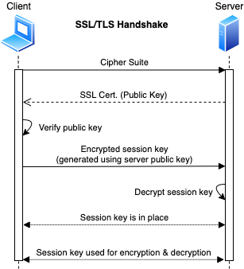
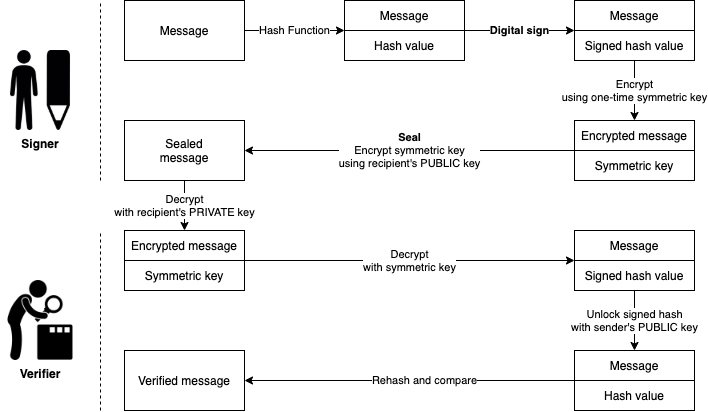
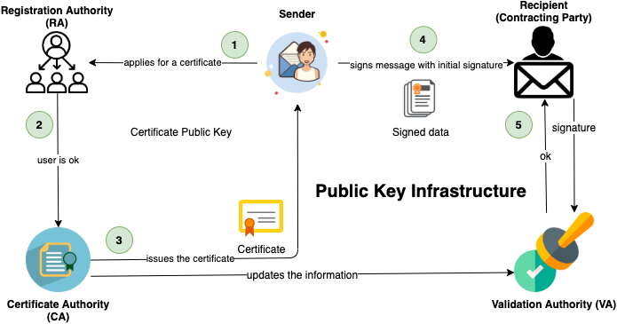
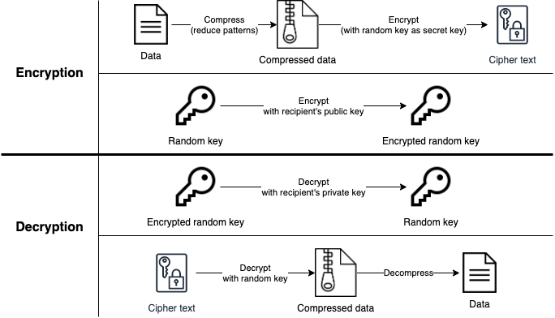

# Encrypting communication

- Can happen in different layers on Internet protocol suite e.g.
  - 1. Link layer: • [PPP]
  - 2. Internet layer: • [IPSec](./tunneling-protocols.md#ipsec)
  - 3. Transport layer: • [TCP](./../03-scanning-networks/tcpip-basics.md#tcpip)
  - 4. Application layer: • [SSH](./tunneling-protocols.md#ssh-secure-shell) • [FTP, SFTP, FTPS](#securing-ftp) • [SSL / TLS](#ssltls)

## SSL/TLS

### SSL (Secure Sockets Layer)

- Protocol on the application layer
- Created to ensure the security of the message transmission over the network and Internet.
  - ❗ Not secure and has known vulnerabilities, use > [TLS](#tls-transport-layer-security) 1.2 instead.
- 📝 Uses both asymmetric and symmetric authentication mechanisms
  - Asymmetric encryption is used to establish a secure session between a client and a server
    - Utilizing [RSA](./encryption-algorithms.md#rsa-rivestshamiradleman) and [digital certificates](#digital-certificate)
  - Symmetric encryption is used to exchange data within the secured session
- Encrypts data at Transport Layer of [TCP/IP stack](./../03-scanning-networks/tcpip-basics.md#tcpip-model) and above

### TLS (Transport Layer Security)

- 📝 More secure successor of [SSL](#ssl-secure-sockets-layer)
- Protocol to establish secure client-server connection.
- Ensures the information integrity and privacy during transmission.
- Uses RSA 1024 and 2048 bits
- ❗ Use at least TLS 1.2, lower version has vulnerabilities.
- Most commonly used implementation of SSL/TLS is OpenSSL library.
- Vulnerabilities include • [Heartbleed (OpenSSL)](./../05-vulnerabilities/common-vulnerabilities.md#heartbleed) • [POODLE](./../05-vulnerabilities/common-vulnerabilities.md#poodle) • [CRIME](./../13-web-applications/session-hijacking.md#crime-attack) and [BREACH](./../13-web-applications/session-hijacking.md#breach-attack) • [Renegotiation attack](./../05-vulnerabilities/common-vulnerabilities.md#ssltls-renegotiation) • [FREAK](./../05-vulnerabilities/common-vulnerabilities.md#freak) • [DROWN](./../05-vulnerabilities/common-vulnerabilities.md#drown)

#### Two layers of TLS

- **TLS Record Protocol**
  - Provides secured communication channel
  - Private connection: using symmetric cryptography for data encryption
  - Reliable connection: providing message integrity check
- **TLS Handshake Protocol**
  - Providing connection security that has three basic properties:
    1. The peer's identity can be authenticated using asymmetric cryptography
    2. The negotiation of a shared secret is secure
    3. The negotiation is reliable
  - TLS Handshake Protocol operates on top of TLS record layer

### SSL/TLS Handshake

## Securing FTP

### Insecure FTP options

#### FTP (File Transfer Protocol)

- Used for the transfer of computer files between a client and server on a computer network.
- Runs on Application layer (4) in internet protocol suite
- Insecure as it has minimal security through user ID and passwords.
- Runs on port 21

#### TFTP (Trivial File Transfer Protocol)

- Less secure than FTP using no authentication at all
- Runs on port 69

### Secure options

- **Encrypting files before using FTP**
  - Does not protect user password, or prevent man in the middle from downloading encrypted files
- **SFTP (SSH File Transfer Program)** | port: 22
  - Uses [SSH](./tunneling-protocols.md#ssh-secure-shell) for authentication and data transport mechanism
- **FTP over SSH**
  - SSH connection must be established between the two systems before the FTP connection is established
- **FTP over [IPSec](./tunneling-protocols.md#ipsec)**
  - IPSec runs on lower layer Internet layer (3) on [IP suite](./../03-scanning-networks/tcpip-basics.md#tcpip-model).
  - Can cause high amount of CPU cycles on interrupt or kernel level.
- **FTP over VPN**
- **FTP over TLS**
  - Also known as • **FTPS** • **FTP-SSL** (old name) • **FTP Secure**
- **Comparison**

  | Method | Password Privacy | Server Verification | Data Privacy | Data Integrity | Test and Binary Transfers | Automatic |
  | ------ | ---------------- | ------------------- | ------------ | -------------- | --------------------- | -------- |
  | **Separate encryption** | No | No | Yes | Maybe | Maybe | No, file must be encrypted and decrypted separated from the transfer |
  | **SFTP** | Yes | Yes, private key | Yes | Yes | Maybe | Yes |
  | **FTP over SSH** | Yes | Yes, private key | Yes | Yes | Yes | No, separate setup of the tunnel is needed |
  | **FTP over IPSec** | Yes | Yes, private key or certificate authority | Yes | Yes | Yes | Yes, but configuration can be a challenge |
  | **FTP over VPN** | Yes | Maybe | Yes | Yes | Yes | Maybe, but may have configuration challenges |
  | **FTPS** | Yes | Yes, private key or certificate authority | Yes | Yes | Yes | No, but it's easy to use |

## Digital signatures

- Created using asymmetric cryptography
- Attached to the transmitted data
- 📝 Usually used in cases where it is important to detect forgery or tampering
  - E.g. • software distribution • financial transactions • contract management software
- 📝 Provides cryptographic way of
  - **Authentication**
    - Verifies identity of the source messages
    - Through a secret-key that's bound to a specific user
  - **Integrity**
    - Ensures the communication is not altered during transmission
    - Avoids forging as any change would invalidate the signature
  - **Non-repudiation** of origin
    - The sender cannot falsely claim that they have not signed the message
- ❗ Risks
  - Revoked secret key (key pair) prior to its usage
  - Leaked secret keys that would continue to implicate the claimed owner of the key-pair
- 📝 Simplified flow
  1. Sender hashes the file and encrypts using **sender's private key**
     - Provides non-repudiation since only the sender has access to their private key.
     - However there's no confidentiality as it can be unencrypted by anyone with access to the sender's public key
     - The hashing of the email is what creates the integrity.
  2. Recipient decrypts the message with its **sender's public key**
- [Digital Signature Algorithm (DSA)](encryption-algorithms.md#dsa-digital-signature-algorithm) is the standard used in generation and verification

### Encryption vs Signing

- When encrypting:
  - You use **their public key** to write a message
  - They use **their private key** to read it
  - > I want my public key to be used to read the messages and I do not care who reads them
- When signing:
  - You use **your private key** to write message's signature
  - They use **your public key** to check if it's really yours.
  - > I only care that I am the only one who can generate these.

### Digital signature flow

## Public Key Infrastructure (PKI)

- Security architecture/structure for managing digital certificates
- 📝 Goal is secure electronic transfer of information for a range of network activities
- Provides confidentiality, integrity, access control, authentication, and non-repudiation of the sender.
- Includes hardware, software, people, policies, and procedures
- Goal is to increase the confidentiality of information that is being exchanged.
- Used widely e.g. by browser, operating systems for system updates...
- **Cross-Certification**
  - Allowing a CA to trust another CS in a completely different PKI
  - Allowing both CAs to validate certificates from either side
- **Single-authority system**
  - CA at the top that creates and issues certificates
- **Hierarchical trust system**
  - CA at the top (root CA)
  - Making use of one or more RAs (subordinate CAs) underneath it to issue and manage certificates

### Key escrow

- Also known as **fair cryptosystem**
- Allows a third party to access sensitive data if the need arises.
- A copy of a private key is stored to provide third-party access and to e.g.
  - facilitate recovery operations
  - comply with a court order

### Actors of PKI

- **Validation authority (VA)**
  - 📝 Used to validate certificates, stores certificates with their public keys
- **Certificate authority (CA)**
  - Also known as **certification authority**
  - 📝 Third party to issue and verify [digital certificate](#digital-certificate)s
    - Digital certificates contain public key and the identity of the owner.
  - E.g. [Comodo](https://ssl.comodo.com/), [IdentTrust](https://www.identrust.com/), [GoDaddy](https://godaddy.com/web-security/ssl-certificate)
- **Registration authority (RA)**
  - 📝 Acts as verifier for the certificate authority
- **Certificate Management System**
  - Generates, distributes, stores, and verifies certificates
- **End user**
  - Requests, manages, and uses certificates

### PKI process flow

1. A ***user*** applies for a certificate with his public key at a ***Registration Authority (RA)***
2. ***Registration Authority (RA)*** confirms the ***user***'s identity to ***Certificate Authority (CA)*** which in turn issues the certificate and informs ***Validation Authority (VA)***
3. The ***user*** can then digitally sign a contract using his new certificate.
4. His identity is then checked by the contracting party with a ***Validation Authority (VA)*** which again receives information about issued certificates by the ***Certificate Authority (CA)***.

## Digital certificate

- Electronic file
- Used to verify a user's identity (= non-repudiation)

### X.509

- Standard protocol used for digital certificates, public key encryption
- Defining all sorts of things regarding PKI including digital certificates
- Identifies components of a digital certificate: • version • algorithm ID • copy of the public key • key usage description

### Digital certificate vs digital signature

- The certificate ties the digital signature to a data object.
  - Digital signature secures the data in transit.
- Digital certificate uses the public key to identify source of the data.
  - the digital signature uses the public key to verify integrity of the data.
- ❗ Signatures do not help with revoked keys and stolen keys
  - CA maintains certificate revocation list
- Certificates helps to prove senders authenticity of public keys (e.g. who signed what)
  1. Sender obtains digital certificate by registering his public key to a certificate authority.
  2. CA uses its private key to sign senders certificate and attaches CA public key to his certificate.
  3. Receiver decrypts and validates signature using certificate authority's public key.

### Certificate types

- **Signed certificate**
  - Issued by Certification Authorities (CA)
  - Contains a public key and the owner's identity.
- **Self-signed certificate**
  - Issued and signed by oneself (not CA)
  - ❗ Not to be trusted
  - Used for testing/development purposes
  - Otherwise better to use [let's encrypt](https://letsencrypt.org/) that offers free SSL/TLS certificates

## PGP (Pretty Good Privacy)

- Encryption program
- Protocol for
  - secure communication through encryption and decryption
  - authentication (ensures users are who they claim to be)
- Uses a serial combination of
  - hashing
  - data compression
  - symmetric-key cryptography
  - public-key cryptography
- Main uses include
  - Sending and receiving encrypted emails.
  - Verifying the identity of the person who has sent you this message
  - Encrypting files
- Available as both open-source and commercial software

### Web of trust

- Used by PGP
- Decentralized model
- Individual users sign keys that belong to other people
- Validates that key are who they say they are

### PGP encryption and decryption workflow

### PGP tools

### GNU Privacy Guard

- Also known as **GnuPG** or **GPG**
- Open-source and free implementation of PGP
- Allows to encrypt and data and communications
- E.g. create key pair `gpg --gen-key`
- E.g. for symmetric encryption only
  - `gpg -c <file-name>` to encrypt
  - `gpg <file-name>` to decrypt

### PGP Alternatives

#### PEM (Privacy-Enhanced Mail)

- Proposed IETF standard for secure email, obsoleted by PGP.
- Depended on a single root certificate for its public key infrastructure (PKI)
- Was impractical and had its own problematic implications for security.

#### S/MIME

- Secure/Multipurpose Internet Mail Extensions
- Standard for encrypting and authenticating MIME data
- Used primarily for Internet e-mail.
- PGP is an application, whereas S/MIME is a protocol.
- PGP can be used to encrypt not only e-mail messages but also files and entire drives.
