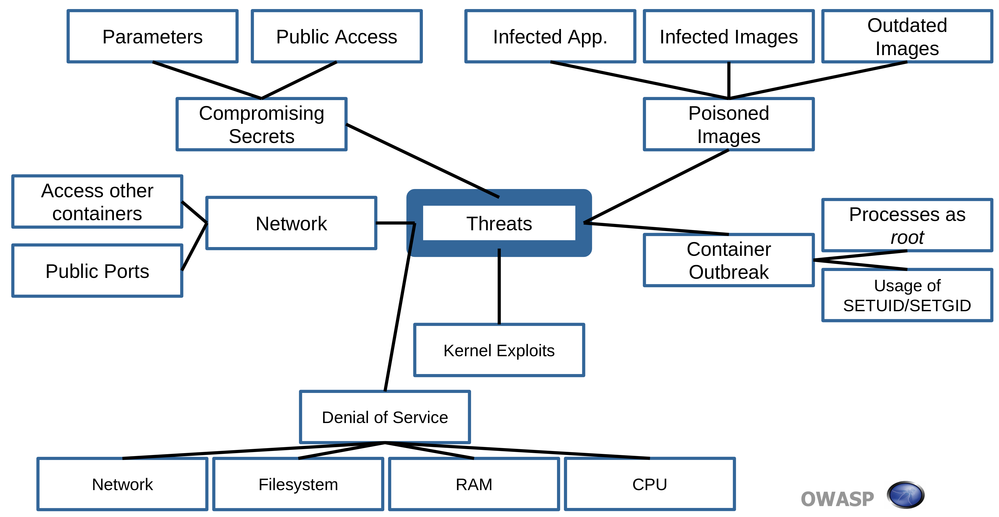

# Containers

- More than one container can run on the same host OS.
- [Docker](https://www.docker.com/) is the standard way of running containers

## Containers vs VMs

- Both reduces cost due to shared hardware.
  - A single physical server can host multiple, concurrent VMs or applications
- A virtual machine virtualizes an operating system
  - A container sandboxes an applications

## Container threats

### Container threat model

- **Container escape (system)**
  1. Attacker needs to escape application and end up in container with shell access
  2. Attacker than uses host or kernel exploit to escape container
- **Other containers via network**
  1. Attacker needs to escape application and end up in container with shell access
  2. Attacker attacks other containers on network
- **Attacking the orchestration tool via network**
  1. Attacker needs to escape application and end up in container with shell access
  2. Attacker attacks on management interfaces or other attacks surfaces of the orchestration tool
     - 🤗 In 2018 almost every tool has had a weakness here which was a default open management interface
- **Attacking the host via network**
  1. Attacker needs to escape application and end up in container with shell access
  2. With shell access attacker opens a port from the host
- **Attacking other resources via network**
  1. Attacker needs to escape application and end up in container with shell access
  2. Attacks e.g. on shared network-based file system, LDAP/Active Directory, Jenkins..
     - Can also install sniffer to read traffic of other containers
- **Resource starvation**
  - Attacker causes a container eating up resources which could be CPU cycles, RAM, network or disk-I/O.
  - 📝 Can cause problems affecting all other containers on same host
- **Host compromise**
  - Either through another container or through the network.
- **Integrity of images**
  - Each step in CD pipeline where container image is attack vector for the attacker.
  - Attacker can inject malicious payloads to deploy.
- 

### OWASP Docker Top 10

1. **Secure user mapping**
   - Docker runs with root.
   - Escape from application => root in container
2. **Patch management strategy**
   - Bugs on container/orchestration tools or OS images needs to be patched.
3. **Network segmentation and firewalling**
   - Design your network upfront providing network level protection for
     - management interfaces from the orchestration too
     - network services from the host
   - Expose microservices to only legitimate consumers
4. **Secure defaults and hardening**
   - Ensure no unneeded components are installed or started.
   - Ensure needed components are properly configured and locked down.
5. **Maintain security contexts**
   - Do not mix production containers on one host with other stages of less secure containers.
   - Do not mix frontend with backend services on one host.
6. **Protect secrets**
   - Ensure passwords, tokens, private keys or certificates are protected.
7. **Resource protection**
   - Protect shared resources such as CPU, disks, memory and networks.
   - Ensures one containers usage does not affect others.
8. **Container image integrity and origin**
   - Ensure OS in container is trustworthy until deployment.
   - Ensure images are not tampered with during transfers.
9. **Follow immutable paradigm**
   - Start containers on read-only mode if no file access is needed
10. **Logging**
    - Log on application, container image and orchestration tool
    - Both related events and API level
    - Ensure logs are stored on remote with timestamps and are tamper proof

## Container attacks

- Attacks are generally not on the containers themselves, but on the applications running in them.
- Exploiting vulnerable images
  - Container image may have outdated software that has vulnerabilities if it's no longer maintained.
  - E.g. Apache OpenWhisk image (Open Source Serverless Cloud Platform) [had a vulnerability where one could replace serverless functions](https://nvd.nist.gov/vuln/detail/CVE-2018-11757).
- Exploiting bugs and vulnerabilities on unpatched Docker
  - E.g. [a bug](https://nvd.nist.gov/vuln/detail/CVE-2019-5736) caused compromised images to access the host OS that has been fixed.
  - E.g. Windows Host Compute Service Shim library had [remote code execution](https://nvd.nist.gov/vuln/detail/CVE-2018-8115) vulnerability
  - E.g. [a bug](https://nvd.nist.gov/vuln/detail/CVE-2018-9862) allowed root privilige escalation using `docker` command
- Creating malicious container on compromised host system
  - E.g. [crypto-miner containers that were running near Russian nuclear warzone](https://www.fortinet.com/blog/threat-research/yet-another-crypto-mining-botnet)
- Exploiting orchestration tool
  - Can be e.g. Kubernetes, OpenShift, Cloud Foundry or other (cloud) layer running containers.
  - See [Kubernetes vulnerabilities on CVE](https://www.cvedetails.com/vulnerability-list/vendor_id-15867/product_id-34016/Kubernetes-Kubernetes.html)

## Container advantages over VM

- **Often no SSH enabled into containers**
  - No SSH attacks
- **Often no user access expected**
  - No need for credentials or tools to support users
- **Restricted ports by default**
  - Specific and limiting about which ports to connect
- **Short-lived containers are unlikely bases for attackers**
  - Harder to compromise a service that only lives for a few seconds/minutes.
- **Immutable designs make it difficult to inject malware**
  - As persistance is usually separated away from the container
- **Automatic generation makes it faster to pick up and promote security patches**
  - Automated CI/CD pipelines make updating libraries/OS much quicker than manual
- **Well-defined APIs enables easier anomaly detection**
  - Developers often create APIs to communicate with containers
  - Makes it easy to create a reference model for what is normal inside an application, so anything outside of that is an anomaly. We can automatically detect any anomalies

## Container security countermeasures

- [OWASP Docker Security Cheat Sheet](https://cheatsheetseries.owasp.org/cheatsheets/Docker_Security_Cheat_Sheet.html)
  - Keep Host and Docker up to date
  - Do not expose the Docker daemon socket (even to the containers)
  - Set a user
  - Limit capabilities (Grant only specific capabilities, needed by a container)¶
  - Add –no-new-privileges flag
  - Disable inter-container communication (--icc=false)
  - Use Linux Security Module (seccomp, AppArmor, or SELinux)
  - Limit resources (memory, CPU, file descriptors, processes, restarts)
  - Set filesystem and volumes to read-only
  - Use static analysis tools
  - Lint the Dockerfile at build time
- **Pre-deploy sources and dependency validation**
  - Ensures containers are using valid and expected code paths.
- **Pre-deploy authenticity validation**
  - Ensures that the code has not been tampered with.
- **Pre-deploy image scanning for vulnerabilities**
  - Looking for signatures of compromised packages
- **Active vulnerability scans of running containers**
  - Running automated scans after the container is deployed.
- **Network routing that includes traffic inspection**
  - Create a function based service firewall.
- **Integrated log capture**
  - Since there's no local storage, most container patterns are including central log capture and analysis
- **External injection of trust and credentials**
  - Giving credentials just-in-time to running live instances rather than static code
- **Always check running containers**
  - To ensure there's no malicious container running.
- **Ensure container images are up-to-date**
  - Unupdated/stale images might be vulnerable
- **Never-ever as root**
  - Run in [rootless mode](https://docs.docker.com/engine/security/rootless/) (as non root)
