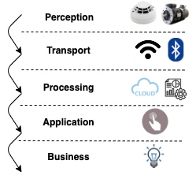

# IoT overview

## IoT basics

- Internet of things
- Extends Internet connectivity beyond standard devices to everyday objects
- Usually uses IPv6 due to the limited number of IPv4 addresses
- Operating systems: Linux or Windows (10) IoT

## Top-level components

- **Device**
  - Includes hardware and software that directly interact with the world.
  - They connect to a network to communicate with each other, or to centralized applications
- **Gateway**
  - Enables services to reach cloud services.
  - Infrastructure component providing security and protocol translations
  - Also used as a service that process data on behalf of group or cluster devices.
  - Often a device e.g. smart home hub.
  - Usually from the same vendor
- **Cloud**
  - See [cloud computing](./../16-cloud-computing/cloud-computing.md)
- **Sensors**
  - Detects, measures or indicates any specific physical quantity
  - E.g. light, heat, motion, moisture, pressure, or similar entities
  - Converts them into any other form which is mostly, electrical pulses.

## IoT communication models

### Device-To-Device (D2D)

- Direct communication between devices
- Uses a medium such as Bluetooth Low Energy etc.
- Common in home automation systems e.g. light bulbs or wearables e.g. smart watch and heart monitor.
- Simpler security
- E.g. **Vehicle-to-vehicle (V2V)**
  - Uses Vehicle Ad Hoc Network (VANET)
    - Based on MANET i.e. decentralized wireless network (without routers)

### Device-To-Cloud (D2C)

- IoT device directly communicating with the cloud server
- Often uses ethernet or WiFi
- Lets the user (and an application) to obtain remote access to a device
- E.g. smart card for dogs, remote monitoring
- Two credentials:
  - the network access credentials (such as the mobile device's SIM card)
  - credentials for cloud access
- E.g. [Nest Learning Thermostat](https://store.google.com/us/product/nest_learning_thermostat_3rd_gen)

### Device-To-Gateway (DTG)

- IoT devices basically connect to an intermediary device to access a cloud service
- Often includes an application software operating on a local gateway device (like a smartphone or a "hub")
- Gateway provides security, protocol translation and usually does aggregation
- E.g. [Samsung SmartThing](https://www.smartthings.com/) ecosystem

### Back-end data-sharing

- Extends device-to-cloud model
- Access are granted to the uploaded data to third-parties
- E.g. [Map My Fitness](https://www.mapmyfitness.com/app) that compiles data from other applications

## Layered architecture

- IoT architecture can be categorized into different layers.
- There's no consistency regarding naming of layer.
  - Different methodologies are used but the concepts they represent are very similar.
- 📝 It usually consists of 5 layers:
  1. [Edge technology layer](#edge-technology-layer) the "IoT objects collecting data"
  2. [Access gateway layer](#access-gateway-layer) the "data transporter"
  3. [Internet layer](#internet-layer) the "endpoint connector"
  4. [Middleware layer](#middleware-layer) the "data analyzer and processor"
  5. [Application layer](#application-layer) the "user interface"
- Some sources also name sixth layer:
  6. [Business layer](#business-layer) the "core logic"
- Each layer is utilized by layer below without knowledge of other layers
- 
- Read more: [IoT Elements, Layered Architectures and Security Issues: A Comprehensive Survey](https://www.mdpi.com/1424-8220/18/9/2796/htm)

### Five-layers of IoT architecture

#### Edge technology layer

- Also known as **perception layer** or **hardware layer**
- Physical objects (hardware components)
  - Covers IoT capable devices
  - E.g. sensors, actuators, heat sensor, RFID tags, readers, device itself
- Connects devices within network and server
- Gathers environment data
- **Key security components**
  - Encryption and key agreement
  - Sensor data protection
- **Vulnerabilities**
  - Eavesdropping: real time attack to intercept privacy communications.
  - Node Capture: capturing a key node such as gateway to reveal information.
  - Fake Node and Malicious: adding node to input fake data to stop transmitting real information
  - Replay (play back) attack: eavesdrops a communication and reusing it to authenticate.
  - Timing Attack: Extract secrets by observing respond time

#### Access gateway layer

- Also known as **network layer** or **transport layer**
- Handles data transmission i.e. transferring the data through network
- E.g. Wi-Fi, bluetooth
- Enables communication
  - Connects two endpoints e.g. a clients with a device.
  - Includes the initial data handling.
  - Through e.g. message routing, message identification, and subscriptions.
- **Key security components**
  - Encryption
  - Identity authentication
- **Vulnerabilities**
  - Denial of Service (DoS) Attack with redundant requests
  - Main-in-The-Middle (MiTM) Attack: to intercept and manipulate data in real-time
  - Storage Attack: Changing data stored in device or cloud
  - Exploit attack: Exploits vulnerabilities in an application, system or hardware

#### Internet layer

- Responsible for end-points connectivity.
- Carries out communication between two endpoints.
  - E.g. device-to-device, device-to-cloud, device-to-gateway and back-end data-sharing.

#### Middleware layer

- Also known as **processing layer**
- Responsible for device and information management.
- Handles data analytics
  - I.e. storing, processing and analysis of data.
  - E.g. data analysis, data aggregation, data filtering, device information discovery, and access control.
- Behaves as interface for two-way communication between
  - [Application layer](#application-layer) (the user interface).
  - [Edge technology layer](#edge-technology-layer) (the hardware).
- **Key security components**
  - Key security layer, secure cloud computing, antivirus
- **Vulnerabilities**
  - Exhaustion: Can disturb memory, battery e.g. after effect of a DoS
  - Malware

#### Application layer

- The user interface for
  - Graphic data representation
  - Controlling, managing and commanding IoT devices.
- Responsible for delivering *service* and *data* to users.
  - A service is application-specific e.g. industrial, manufacturing, automobile, security, healthcare...
- **Key security components**
  - Authentication
  - Key agreement
- **Vulnerabilities**
  - Cross site scripting: injecting code through e.g. JavaScript
  - Malicious code attack: can activate itself or require user attention to perform an action.
  - Dealing with Mass Data
    - Caused by massive amount of data transmission
    - Can lead to data loss and network disturbance

### Other IoT layers

#### Business layer

- Includes business models
- System management
- **Key security components**
  - Privacy protection
- **Vulnerabilities**
  - Business logic attack: exploits a programming flaw
  - Zero-day attack: exploits security hole unknown to the vendor

## IoT connectivity

### Wireless IoT connectivity

| Approx. range up to | Connectivity | Speed |
|:-------------------:| ------------ | ----- |
| 10 cm | NFC | 424 kbit/s |
| 1 m | RFID | 300 tags per second |
| 10 m | Li-Fi | 100 gbit/s |
| 60 m | Bluetooth low energi (BLE) | 1 or 2 mbit/s |
| 100 m | WiFi | 1300 mbit/s |
| 1 km | Wi-Fi HaLow | 78 mbit/s |
| 2 km | 5G | 20 gbit/s |
| 30 km | LTE-Advanced | 300 mbit/s |
| 70 km | Celullar | - (depends on 4g etc.) |
| 1000 km | LPWAN | 200 kbit/s |
| World-wide | VSAT | 16 mbit/s |

#### Short-range wireless communication

- **Bluetooth Low Energy (BLE)**
  - Newer versions of bluetooth (after 4.0)
  - Optimized for battery usage.
- **Wi-Fi**
  - Wireless network protocol using radio waves.
  - Wi-Fi 6 specification standard (2020) is the latest standard (x6 faster).
- **Radio-Frequency Identification (RFID)**
  - Data storage tag that can be attached to an item for tracking
  - Passive tag has range up to 1m while active tags can go up to 100m.
  - Used in e.g. passports, credit cards.
- **Li-Fi (Light-Fidelity)**
  - Similar to Wi-Fi, but using visible light for communication
- **Near-Field Communication (NFC)**
  - Based on a radio frequency (RF)
  - Used e.g. in phones, payment cards
  - Must either either physically touch or be in a few centimeters of each other.

#### Medium-Range Wireless Communication

- **LTE-Advanced**: Formally submitted as a candidate 4G, often being described as 3.9G.
- **Wi-Fi HaLow**: low power, long-range, also known as "WiFi for Internet of Things"
- **5G**: Introduced in 2019, highest with minimum of 10 Gbps

#### Long Range Wireless Communication

- **Low-Power Wild-Area Network (LPWAN)**
  - Long range communication (up to 10 km) at a low bit rate
- **(VSAT) Very Small Aperture Terminal**
  - World-wide satellite communication technology uses small dish antennas
- **Cellular** using e.g. radio towers to spread e.g. 4G, 5G..

### Wired IoT connectivity

- **Ethernet** (cat 6 up to 10 Gbps speed)
- **Power-Line Communication (PLC)** : using electrical wiring to carry power and data, around 200 Mbit/s.
